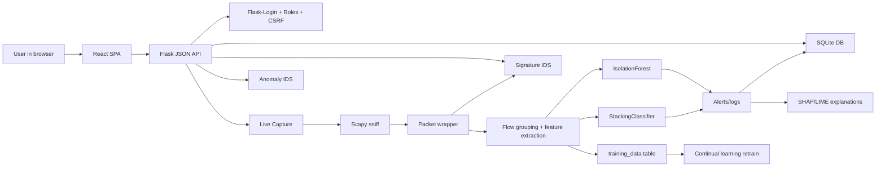
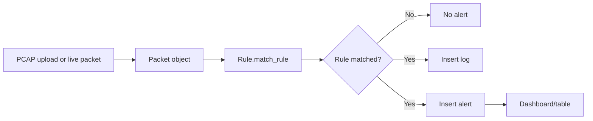
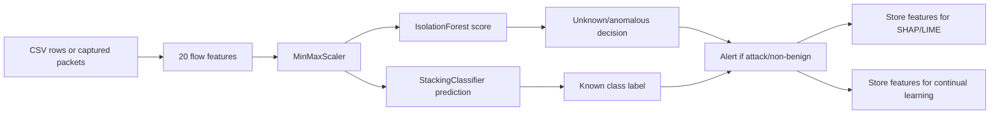

# HOLMES IDS Detailed Project Report

Generated for the local project at:

`C:\Users\moham\Desktop\IDS-Grad-Helwan\IDS_GradProjecet`

This report explains the project based on the actual source files and saved model artifacts in the repository. It focuses especially on the machine learning pipeline, security features, live capture path, signature detection, anomaly detection, explainability, and continual learning.

## 1. Project Overview

HOLMES IDS is an Intrusion Detection System with a Flask backend and a React frontend. It supports three main security workflows:

1. Signature-based detection using manually stored rules.
2. Machine-learning anomaly detection using flow features, an Isolation Forest, and a stacked multi-class classifier.
3. Live capture that runs both signature detection and anomaly detection against traffic captured from a selected network interface.

The system stores logs, alerts, rules, users, explanation features, live training samples, and retraining jobs in SQLite. The frontend provides dashboards for signature alerts, anomaly alerts, live capture, PCAP upload, CSV upload, rules, analytics, user administration, explainability, and continual learning.

## 2. Main Technology Stack

Backend:

- Python
- Flask
- Flask-Login
- SQLite
- Scapy
- pandas
- numpy
- scikit-learn
- joblib
- CatBoost
- SHAP
- LIME
- imbalanced-learn / SMOTE
- matplotlib
- tshark integration for TLS metadata/decryption

Frontend:

- React
- Vite
- React Router
- CSS modules/global CSS under `frontend/src/styles`

Data and models:

- CIC-style network flow features
- StackingClassifier
- DecisionTreeClassifier
- LogisticRegression
- KNeighborsClassifier
- CatBoostClassifier
- RandomForestClassifier as the final stacking/meta classifier
- IsolationForest for unknown/anomalous flow detection
- MinMaxScaler
- LabelEncoder

## 3. High-Level Architecture



## 4. Project Structure

### Backend Core Files

`UI.py`

- Main Flask application entry point.
- Creates `IDS_app`.
- Configures Flask-Login.
- Loads model artifacts into `app_state`.
- Registers API blueprints from `api_auth.py` and `api_routes.py`.
- Creates database tables on startup.
- Ensures a default admin exists.
- Loads signature rules from the database.
- Starts Flask on port `8000`.
- Also contains legacy server-rendered template routes in addition to the newer JSON API routes.

`app_state.py`

- Stores shared application state.
- Defines paths and upload extension allowlists.
- Holds loaded ML artifacts:
  - `model`
  - `iso_forest`
  - `scaler`
  - `label_encoder`
  - `feature_order`
- Holds loaded rules and the current live capture instance.
- Provides file validation for uploads.
- Provides network interface enumeration using Scapy.

`api_auth.py`

- Provides JSON auth endpoints under `/api/auth`.
- Endpoints:
  - `GET /api/auth/csrf`
  - `GET /api/auth/me`
  - `POST /api/auth/login`
  - `POST /api/auth/logout`
- Uses Flask sessions and Flask-Login.
- Generates and validates CSRF tokens for logout.

`api_routes.py`

- Provides JSON API endpoints used by the React frontend.
- Covers:
  - signature dashboard
  - anomaly dashboard
  - CSV upload
  - PCAP upload
  - rules list
  - live capture status/start/stop/clear/delete
  - admin user management
  - SHAP/LIME explainability
  - continual learning dashboard/retrain/labeling
  - analytics query builder

`auth.py`

- Defines user model and role-based access control.
- Uses Werkzeug password hashing.
- Defines roles:
  - `admin`
  - `signature_analyst`
  - `anomaly_analyst`
  - `live_operator`
- Provides `role_required`.
- Creates default admin user when the users table is empty.

`DB.py`

- SQLite database wrapper.
- Opens connections with `check_same_thread=False`, timeout `10`, and WAL mode.
- Creates tables:
  - `rules`
  - `logs`
  - `alerts`
  - `users`
  - `alert_features`
  - `training_data`
  - `retrain_jobs`
- Restricts `clear_table` to a fixed allowlist.

### Detection and Packet Files

`packet.py`

- Wraps a Scapy packet.
- Extracts:
  - protocol
  - source IP
  - destination IP
  - source port
  - destination port
  - TCP/IP flags
  - packet size
  - payload
  - timestamp
- Maintains global source and destination IP counters used by threshold-based rules.

`flow.py`

- Groups packets into bidirectional flows.
- Computes the exact 20 model features used by the anomaly system.

`rule.py`

- Represents one signature rule.
- Matches packet headers and options.
- Supports protocol/IP/port matching and rule options such as:
  - `content`
  - negated `content`
  - `pcre`
  - `flags`
  - `dsize`
  - `threshold`
  - `detection_filter`
  - `itype`
- Reads rules from the database.

`signature_IDS.py`

- Runs signature rules over packets.
- Supports PCAP scanning and live packet matching.
- Creates logs and alerts when rules match.
- Uses `ThreadPoolExecutor` for PCAP processing.

`anomaly_IDS.py`

- Runs anomaly detection on uploaded CSV files and grouped PCAP/live flows.
- Uses:
  - `Flow.compute_features`
  - `MinMaxScaler`
  - `IsolationForest`
  - stacked classifier
  - label encoder
- Stores alert features for SHAP/LIME.

`live_capture.py`

- Runs real-time capture using `scapy.sniff`.
- Runs per-packet signature detection immediately.
- Buffers packets for flow-based anomaly detection every 10 seconds.
- Stores flow features for continual learning.
- Stores alert features for explainability.

### Machine Learning and Explainability Files

`explainability.py`

- Implements SHAP and LIME explanations for anomaly alerts.
- Stores and retrieves alert feature vectors.
- Provides a glossary for all 20 flow features.
- Creates base64 PNG charts using matplotlib.

`continual_learning.py`

- Stores live flow features in `training_data`.
- Allows admin/human labeling.
- Retrains the classifier and Isolation Forest.
- Applies SMOTE when available.
- Saves candidate models.
- Promotes models only if evaluation gates pass.
- Saves rollback copies of previous models.

`evaluate_anomaly.py`

- Evaluation script for the anomaly pipeline and model performance.

### Security and Analytics Files

`analytics.py`

- Implements a safe query builder.
- Does not expose raw SQL to the user.
- Uses field allowlists and parameterized values.
- Supports filters, grouping, time ranges, metrics, and detection patterns.

`tls_decrypt.py`

- Integrates with `tshark`.
- Can decrypt PCAP traffic when a keylog file is provided.
- Can extract TLS metadata such as TLS handshake information when decryption is unavailable.

`ntp_time.py`

- Provides NTP synchronization and timestamp helper functions.

### Frontend Files

`frontend/src/App.jsx`

- Defines React routes and role-protected pages.

`frontend/src/api/client.js`

- Frontend HTTP client.
- Handles backend API requests and CSRF token behavior.

`frontend/src/context/AuthContext.jsx`

- Stores authentication state.
- Calls login/logout/me endpoints.

`frontend/src/components/ProtectedRoute.jsx`

- Enforces frontend route access based on user role.

`frontend/src/components/Layout.jsx`

- Shared page layout.

`frontend/src/components/Navbar.jsx`

- Main navigation.

`frontend/src/components/AlertsTable.jsx`

- Reusable alert table.
- Supports anomaly explain links where enabled.

Frontend pages:

- `LoginPage.jsx`
- `SignaturePage.jsx`
- `AnomalyPage.jsx`
- `CsvUploadPage.jsx`
- `PcapUploadPage.jsx`
- `RulesPage.jsx`
- `LiveCapturePage.jsx`
- `AdminPage.jsx`
- `ExplainPage.jsx`
- `RetrainPage.jsx`
- `AnalyticsPage.jsx`

## 5. Database Schema

The database is `DB/IDS.db`.

### `rules`

Stores signature rules.

Columns:

- `id`
- `action`
- `protocol`
- `src_ip`
- `src_port`
- `direction`
- `dst_ip`
- `dst_port`
- `options`

The `options` column stores JSON rule options.

### `logs`

Stores event logs.

Columns:

- `id`
- `timestamp`
- `event_type`
- `src_ip`
- `dst_ip`
- `message`
- `attack`
- `method`

### `alerts`

Stores security alerts.

Columns:

- `id`
- `timestamp`
- `src_ip`
- `dst_ip`
- `message`
- `attack`
- `method`

The `method` value identifies whether the alert came from `signature` or `anomaly`.

### `users`

Stores login users.

Columns:

- `id`
- `username`
- `password_hash`
- `role`
- `created_at`

### `alert_features`

Stores raw anomaly feature vectors linked to alerts.

Columns:

- `id`
- `alert_id`
- `features_json`
- `predicted_label`
- `confidence`
- `created_at`

This table is required for SHAP/LIME explanations because the explanation endpoint needs the exact feature vector that produced the alert.

### `training_data`

Stores live flow features for continual learning.

Columns:

- `id`
- `features_json`
- `predicted_label`
- `confidence`
- `human_label`
- `feature_version`
- `source`
- `created_at`

Only samples with `human_label IS NOT NULL` are used for retraining.

### `retrain_jobs`

Tracks retraining attempts.

Columns:

- `id`
- `status`
- `started_by`
- `started_at`
- `finished_at`
- `old_accuracy`
- `new_accuracy`
- `old_f1`
- `new_f1`
- `promoted`
- `samples_used`
- `error_message`

## 6. End-to-End System Flow

### Normal Browser Flow

1. User opens the React frontend at `http://127.0.0.1:5174`.
2. React calls the Flask backend at `http://127.0.0.1:8000`.
3. User logs in through `/api/auth/login`.
4. Flask-Login creates a session cookie.
5. The frontend requests protected data from `/api/...`.
6. Backend route decorators verify the user and role.
7. Backend reads/writes SQLite and returns JSON.
8. React renders dashboards, alerts, tables, forms, charts, and controls.

### Signature Detection Flow



### Anomaly Detection Flow



### Live Capture Flow

1. User selects a network interface in the Live Capture page.
2. Frontend calls `POST /api/live/start`.
3. Backend creates a `LiveCapture` instance.
4. `LiveCapture.start()` starts three background threads:
   - capture thread
   - flow processing thread
   - training-data writer thread
5. The capture thread calls `scapy.sniff`.
6. Each raw packet is wrapped with `Packet`.
7. Signature rules are applied immediately.
8. Raw packets are buffered.
9. Every 10 seconds, buffered packets are grouped into flows.
10. Each flow is converted into 20 features.
11. Features are scaled.
12. Isolation Forest and the classifier are applied.
13. Non-benign detections become alerts/logs.
14. Feature vectors are stored for SHAP/LIME.
15. Feature vectors are queued and batch-written to `training_data`.

## 7. Packet Processing Details

The `Packet` class extracts security-relevant values from Scapy packets:

- TCP packets become protocol `tcp`.
- UDP packets become protocol `udp`.
- ARP packets become protocol `arp`.
- ICMP packets become protocol `icmp`.
- Other IP packets become protocol `ip`.
- Unknown packets become `N/A`.

IP extraction:

- IP packets use `IP.src` and `IP.dst`.
- ARP packets use `ARP.psrc` and `ARP.pdst`.

Port extraction:

- TCP packets use TCP source/destination ports.
- UDP packets use UDP source/destination ports.
- Other packets use `N/A`.

Payload extraction:

- If a packet has a Raw layer, the Raw bytes are decoded with errors ignored.
- If decoding fails, payload is represented as hex.
- Packets without Raw payload return an empty string.

TCP flag extraction:

- SYN: `S`
- ACK: `A`
- FIN: `F`
- PSH: `P`
- RST: `R`
- URG: `U`
- ECE: `E`
- CWR: `C`

IP flag extraction:

- Don't Fragment: `DF`
- More Fragments: `MF`

The class also keeps global source and destination IP counters. These counters support rule threshold logic, such as detecting many packets from the same source.

## 8. Flow Feature Extraction

The anomaly model does not classify individual packets directly. It classifies network flows.

`Flow.group_into_flows` builds bidirectional flow keys:

`(src_ip, dst_ip, src_port, dst_port, protocol)`

If the reverse key already exists, packets are added to the existing flow. This means both directions of a conversation can be grouped together.

The project extracts 20 features from each flow:

1. `FwdPacketLengthMean`
2. `FwdPacketLengthMax`
3. `FlowIATMax`
4. `SubflowBwdBytes`
5. `Init_Win_bytes_backward`
6. `TotalLengthofBwdPackets`
7. `FlowPackets/s`
8. `TotalLengthofFwdPackets`
9. `BwdPackets/s`
10. `AveragePacketSize`
11. `FlowDuration`
12. `BwdPacketLengthMean`
13. `SubflowFwdBytes`
14. `AvgBwdSegmentSize`
15. `FwdPacketLengthStd`
16. `AvgFwdSegmentSize`
17. `DestinationPort`
18. `BwdHeaderLength`
19. `PacketLengthMean`
20. `BwdPacketLengthStd`

Important details:

- Forward direction is based on the source IP of the first packet in the flow.
- Backward direction is packets whose source IP differs from the first packet source IP.
- Flow duration uses first and last packet timestamps.
- A very small fallback duration `1e-6` avoids division by zero.
- Packet rates are calculated using packet count divided by duration.
- TCP window size is taken from the first backward TCP packet where available.

## 9. Machine Learning Artifacts

The application loads model artifacts at startup in `UI.py`.

Loaded files:

- `Models/Models/tst1_stk_classifier.joblib`
- `Models/Models/isolation_forest.joblib`
- `Models/Scaler/scaler_minmax.save`
- `Models/Label Encoder/lb_encoder.pkl`
- `Models/Features_Order/features_order.pkl`

The saved classifier is a `StackingClassifier`.

Base estimators:

- `DecisionTreeClassifier`
- `LogisticRegression`
- `KNeighborsClassifier`
- `CatBoostClassifier`

Final/meta classifier:

- `RandomForestClassifier`

Scaler:

- `MinMaxScaler`

Unknown/anomaly detector:

- `IsolationForest`

Isolation Forest parameters from the saved artifact:

- `n_estimators`: `100`
- `contamination`: `0.05`
- `max_samples`: `auto`
- `max_features`: `1.0`
- `bootstrap`: `False`
- `random_state`: `42`
- `warm_start`: `False`

Label classes:

- `BENIGN`
- `Bot`
- `Brute_Force`
- `DDoS`
- `DoS`
- `Heartbleed`
- `Infiltration`
- `Port_Scan`
- `Web_Attack`

There is also a saved Keras model at:

- `Models/Models/dnn_ids_model.h5`

Based on the inspected runtime code, the Flask application does not load or use this DNN model during active prediction.

## 10. Why the Project Uses Multiple Classifiers

The classifier is an ensemble stack. The base models each learn patterns differently:

`DecisionTreeClassifier`

- Learns if/then style splits.
- Can capture sharp threshold behavior such as high packet rate, unusual destination port, or abnormal packet size.
- Easy to overfit alone.

`LogisticRegression`

- Learns linear relationships between features and classes.
- Often stable and fast.
- Good when a class can be separated by weighted combinations of features.
- Weak when attack behavior is nonlinear.

`KNeighborsClassifier`

- Compares a new flow to nearby examples in the training data.
- Useful when attacks form clusters in feature space.
- Can be slower and sensitive to feature scaling.

`CatBoostClassifier`

- Gradient boosting model.
- Strong at nonlinear tabular classification.
- Can capture complex feature interactions.

`RandomForestClassifier`

- Used as the final/meta classifier.
- Receives the outputs of the base models.
- Learns how to combine their opinions.
- Helps when one model is strong for one attack type and another model is strong for a different attack type.

The Random Forest is not used alone because the stack can combine different decision styles. A Random Forest alone would only provide one family of model behavior. The stacking design lets the final model learn patterns such as:

- trust CatBoost more for some classes
- trust KNN more when the flow resembles known local clusters
- trust Logistic Regression where linear separation is enough
- use Decision Tree splits where thresholds are clear

## 11. How the Classifier Prediction Happens

Prediction uses this sequence:

1. Build a one-row pandas DataFrame using the 20 feature names in `feature_order`.
2. Scale the values using `MinMaxScaler`.
3. Call `model.predict(df_scaled)`.
4. Convert the encoded class ID back into a readable label using `LabelEncoder.inverse_transform`.
5. Try to call `model.predict_proba(df_scaled)`.
6. Use the maximum probability as confidence.

The classifier is supervised. It knows whether a flow is malicious because it was trained on labeled examples where feature patterns were associated with labels such as `BENIGN`, `DDoS`, `DoS`, `Bot`, and `Port_Scan`.

For example:

- A port scan may show many connection attempts, unusual destination ports, and short flow behavior.
- A DoS attack may show high packet rates or abnormal packet-size patterns.
- Bot traffic may show behavior similar to botnet examples in the training data.

The model does not understand packet content like a human analyst. It learns statistical relationships between flow features and labels.

## 12. Isolation Forest Detection

The Isolation Forest is used as an unsupervised anomaly detector.

Purpose:

- Detect flows that look unusual compared with normal/training distribution.
- Help catch unknown or out-of-distribution attacks that the supervised classifier may not label correctly.

How it works conceptually:

- It builds many random isolation trees.
- Unusual samples are easier to isolate with fewer random splits.
- Normal samples tend to require more splits because they are in denser regions.
- The model returns an anomaly score through `decision_function`.

In this project:

- Features are scaled first.
- `decision_function(df_scaled)[0]` produces the score.
- A threshold of `-0.000001` is used in `live_capture.py` and `anomaly_IDS.py`.
- If `score < threshold`, the flow is treated as unknown/anomalous.

Important difference:

- Isolation Forest decides whether a flow is unusual.
- The classifier decides which known class the flow resembles.

## 13. Anomaly Detection in CSV Upload

CSV upload endpoint:

- `POST /api/uploads/csv`

Processing file:

- `api_routes.py`
- `AnomalyIDS.predict_from_csv`

CSV path:

1. User uploads CSV.
2. Backend validates `.csv` extension.
3. File is saved in `uploads`.
4. `AnomalyIDS.predict_from_csv` reads it with pandas.
5. Column names are normalized to handle CIC naming differences.
6. Required feature columns are mapped to `feature_order`.
7. Missing features raise an error.
8. Infinite values and NaN values are replaced with `0`.
9. Features are scaled.
10. Isolation Forest scores all rows.
11. Classifier predicts all rows.
12. If Isolation Forest flags a row, prediction becomes `Unknown Attack`.
13. Otherwise the classifier label is used.
14. Summary stats count:
    - `BENIGN`
    - `ATTACK`
    - `UNKNOWN`

The CSV upload route returns at most 500 predictions to avoid very large JSON responses, while summary stats cover the full file.

## 14. Anomaly Detection in Live Capture

Live capture path:

- `POST /api/live/start`
- `LiveCapture.start`
- `_capture_loop`
- `_process_packet`
- `_flow_processing_loop`
- `_process_flow_buffer`
- `_analyze_flow`

Live anomaly detection works in batches:

- Packets are captured continuously.
- Raw packets are added to `_packet_buffer`.
- Every `FLOW_WINDOW = 10` seconds, buffered packets are drained.
- Packets are converted into `Packet` objects.
- Only `tcp`, `udp`, and `icmp` packets with valid source IP are used for anomaly flows.
- Packets are grouped into flows.
- Each flow is analyzed separately.

Live flow analysis:

1. Compute 20 flow features.
2. Build DataFrame with `feature_order`.
3. Scale with `MinMaxScaler`.
4. Compute Isolation Forest score.
5. Predict with StackingClassifier.
6. Get classifier probability if possible.
7. Store features for continual learning.
8. If final predicted label is not `BENIGN`, create alert/log.
9. Store features in `alert_features` for explanation.

Live relabeling behavior:

- If Isolation Forest fires and the classifier predicts `BENIGN`, the code tries to avoid showing only `Unknown Attack`.
- It checks classifier probabilities for non-BENIGN classes.
- If a non-BENIGN class exists in the probability array, it chooses the strongest non-BENIGN class.
- If no usable non-BENIGN probability exists, it falls back to `Unknown Attack`.

This is why live capture can show labels such as `Expected Bot` even when the confidence is `0%`: the label may come from the fallback relabel step, not from a strong classifier probability.

## 15. Signature Detection

Signature detection is rule-based.

Rules are stored in the `rules` database table. Each rule includes:

- action
- protocol
- source IP
- source port
- direction
- destination IP
- destination port
- JSON options

Header matching checks:

- protocol
- source IP
- destination IP
- source port
- destination port

Option matching supports:

- `content`: payload must contain this string.
- `!content`: payload must not contain this string.
- `pcre`: regex search over payload.
- `flags`: exact TCP/IP flag string match.
- `dsize`: packet size must be at least the configured value.
- `threshold`: source/destination count threshold.
- `detection_filter`: `track_by_src` or `track_by_dst`.
- `itype`: ICMP type match.

When a rule matches:

- A log is written.
- An alert is written.
- The alert method is `signature`.
- The attack/category is taken from `rule.options["attack"]` where available.
- The alert message is taken from `rule.options["msg"]` where available.

Signature detection runs in:

- PCAP upload through `SignatureIDS.predict_from_pcap`.
- Live capture through `LiveCapture._process_packet`.

## 16. Explainability: SHAP and LIME

Explainability is implemented and used for anomaly alerts that have saved feature vectors.

Important files:

- `explainability.py`
- `api_routes.py`
- `frontend/src/pages/ExplainPage.jsx`
- `frontend/src/components/AlertsTable.jsx`
- `frontend/src/pages/AnomalyPage.jsx`

Endpoint:

- `GET /api/explain/<alert_id>`

Flow:

1. The anomaly detector creates an alert.
2. The detector stores the flow feature vector in `alert_features`.
3. User opens the Explain link in the anomaly UI.
4. Backend retrieves the stored features.
5. Backend computes SHAP explanation.
6. Backend loads up to 500 training CSV rows as LIME background data.
7. Backend computes LIME explanation.
8. Backend returns:
   - predicted label
   - confidence
   - raw features
   - SHAP result
   - LIME result
   - glossary
9. Frontend renders charts and feature tables.

SHAP behavior:

- The project tries to explain the stacking classifier.
- It uses the final estimator, a RandomForestClassifier, with `TreeExplainer`.
- Because the final estimator receives stacked meta-features, `_map_stacked_to_original` approximates mapping back to the original 20 flow features.
- If the tree-based path fails, it falls back to `KernelExplainer` over the full model probability function.

LIME behavior:

- Uses `LimeTabularExplainer`.
- Background data comes from the training CSV when possible.
- Explains the predicted class from the classifier.
- Produces feature contributions and a chart.

Important limitation:

- SHAP/LIME explain the classifier decision. They do not directly explain the Isolation Forest anomaly score.
- Therefore an Isolation Forest-triggered fallback label may have weak or confusing classifier confidence.

## 17. Continual Learning

Continual learning is implemented in `continual_learning.py`.

Purpose:

- Collect live flow features.
- Allow humans to review and label them.
- Retrain models using original data plus human-labeled live samples.
- Promote new models only if quality gates pass.

Data collection:

- Live capture queues every analyzed flow in `_feature_queue`.
- Background writer batches records into `training_data`.
- Stored fields include features, predicted label, confidence, feature version, and source.

Human labeling:

- Admin can label samples through retrain endpoints/UI.
- Labels are stored as `human_label`.
- Unlabeled samples are not used for retraining.

Retraining pipeline:

1. Load feature order.
2. Load label encoder.
3. Load original training CSV.
4. Load human-labeled samples from the database.
5. Skip human labels not present in the existing label encoder classes.
6. Combine original data and valid human-labeled samples.
7. Train/test split with stratification.
8. Scale features with existing MinMaxScaler.
9. Apply SMOTE if available.
10. Evaluate old model on the test set.
11. Clone and fit the old stacking classifier.
12. Clone and fit the old Isolation Forest.
13. Evaluate new classifier.
14. Compute false positive rate for BENIGN samples.
15. Save candidate model artifacts.
16. Promote only if:
    - weighted F1 is at least `0.95`
    - false positive rate is at most `0.05`
17. Save previous active model into rollback directory before promotion.
18. Update `retrain_jobs`.

Promotion thresholds:

- `MIN_F1_THRESHOLD = 0.95`
- `MAX_FPR_THRESHOLD = 0.05`
- `MIN_SAMPLES_PER_CLASS = 10`

Important data quality detail:

- Live data is not automatically trusted for retraining.
- Only human-labeled samples are used.
- The original training dataset is also included.
- The code replaces invalid/unknown labels by skipping them.
- It does not perform advanced cleaning of human-labeled live samples beyond feature alignment and label validation.

## 18. SMOTE

SMOTE means Synthetic Minority Oversampling Technique.

In this project it is used during retraining to balance classes in the training split.

Why it matters:

- Security datasets often have many BENIGN samples and fewer rare attack samples.
- A model trained on imbalanced data may ignore rare attacks.
- SMOTE creates synthetic examples for minority classes by interpolating between nearby minority samples.

In the code:

- SMOTE is imported from `imblearn.over_sampling`.
- It runs only if imbalanced-learn is installed.
- It is applied to the training split only, not the test split.
- If SMOTE fails, retraining continues without SMOTE.

## 19. Model Accuracy and Evaluation

The project includes `evaluate_anomaly.py` for model evaluation.

Known evaluated results from the active artifacts:

- Stacking classifier accuracy: about `99.74%`
- Weighted F1: about `99.74%`
- Weighted precision: about `99.74%`
- Weighted recall: about `99.74%`
- Full pipeline attack detection rate: about `99.85%`
- Benign accuracy in full pipeline: about `94.35%`
- Isolation Forest unknown sample detection in the evaluation script: `100/100`

Important interpretation:

- These metrics describe the evaluation script and available datasets/artifacts.
- They do not guarantee the same performance on real live traffic.
- Live traffic can differ from CIC-style training data.
- Feature extraction differences and local network behavior can reduce accuracy.

## 20. Security Controls

### Authentication

- Uses Flask-Login sessions.
- Passwords are hashed with Werkzeug.
- User records are stored in SQLite.
- `/api/auth/me` reports current session state.

### Role-Based Access Control

Backend roles:

- `admin`: full access.
- `signature_analyst`: signature dashboard, PCAP upload, rules, analytics.
- `anomaly_analyst`: anomaly dashboard, CSV upload, explanations, analytics.
- `live_operator`: live capture operations.

Backend decorators enforce role checks on API routes.

Frontend protected routes also enforce role visibility.

### CSRF Protection

- `api_auth.py` creates a random session CSRF token.
- Mutating auth logout checks `X-CSRFToken`.
- The frontend client is designed to fetch and send CSRF tokens.

Important note:

- CSRF validation is clearly implemented for logout in `api_auth.py`.
- Many other mutating API routes rely on login/role protections but do not call the `_check_csrf` helper in the inspected code.

### Upload Safety

PCAP upload:

- Allowed extensions: `.pcap`, `.pcapng`
- Filename sanitized with `secure_filename`.

CSV upload:

- Allowed extension: `.csv`
- Filename sanitized with `secure_filename`.

TLS keylog upload:

- Keylog filename is sanitized.
- Temporary keylog file is removed after use.

### SQL Injection Resistance

The analytics query builder avoids exposing raw SQL.

Protection methods:

- allowed dataset/table names
- allowed column names
- allowed operators
- parameterized values
- query result limits

Direct query route in `api_routes.py` also validates:

- table allowlist
- column allowlist
- sort direction
- limit capped at `500`

### TLS Handling

The PCAP upload feature can optionally use a TLS keylog file.

Security meaning:

- If a valid keylog file is provided, decrypted HTTP data may be extracted.
- If no keylog is provided, TLS metadata can still be extracted where tshark is available.

Risk:

- TLS keylog files are sensitive because they can decrypt captured sessions.
- The code removes uploaded keylog files after processing, which is good.

### Live Capture Privileges

Live capture uses Scapy sniffing.

Operational impact:

- On Windows, Npcap is usually required.
- Administrator privileges may be required depending on interface and Npcap configuration.
- Capturing traffic has privacy/security implications because packet payloads may be processed.

## 21. Frontend Feature Summary

Signature dashboard:

- Shows signature logs and alerts.
- Shows rule-related data and top IPs.

Anomaly dashboard:

- Shows anomaly logs and alerts.
- Provides Explain links for anomaly alerts with stored feature data.

CSV upload:

- Uploads CIC-style feature CSVs.
- Displays predictions and summary stats.

PCAP upload:

- Uploads PCAP/PCAPNG files.
- Runs signature detection.
- Optionally handles TLS keylog input.

Rules:

- Displays loaded signature rules.

Live capture:

- Lists network interfaces.
- Starts/stops capture.
- Shows status:
  - running/stopped
  - selected interface
  - packet count
  - alert count
- Shows live alerts.
- Supports clear/delete.

Explain page:

- Shows prediction label and confidence.
- Shows SHAP chart/table.
- Shows LIME chart/table.
- Shows raw feature values and glossary information.

Retrain page:

- Shows training data stats.
- Shows samples collected from live capture.
- Allows labeling.
- Shows retrain history/status.
- Can start retraining.

Analytics page:

- Provides query builder style access to alert/log data.
- Supports filtering, grouping, limits, and detection-style queries.

Admin page:

- Lists users.
- Creates users.
- Updates roles.
- Deletes users except default admin.

## 22. API Endpoint Summary

Auth:

- `GET /api/auth/csrf`
- `GET /api/auth/me`
- `POST /api/auth/login`
- `POST /api/auth/logout`

Dashboards:

- `GET /api/signature/dashboard`
- `GET /api/anomaly/dashboard`

Uploads:

- `POST /api/uploads/csv`
- `POST /api/uploads/pcap`

Rules:

- `GET /api/rules`

Live capture:

- `GET /api/live/status`
- `POST /api/live/start`
- `POST /api/live/stop`
- `POST /api/live/clear`
- `POST /api/live/delete`

Admin:

- `GET /api/admin/users`
- `POST /api/admin/users`
- `DELETE /api/admin/users/<user_id>`
- `PUT /api/admin/users/<user_id>/role`

Explainability:

- `GET /api/explain/<alert_id>`

Continual learning:

- `GET /api/retrain/dashboard`
- `POST /api/retrain/start`
- `POST /api/retrain/label`

Analytics:

- `POST /api/analytics/query`

## 23. Security Meaning of the Detected Labels

`BENIGN`

- The classifier considers the flow normal.

`Bot`

- The flow resembles botnet/bot traffic from the training data.

`Brute_Force`

- The flow resembles brute-force attack patterns.

`DDoS`

- The flow resembles distributed denial-of-service traffic.

`DoS`

- The flow resembles denial-of-service traffic.

`Heartbleed`

- The flow resembles Heartbleed-class behavior from the dataset.

`Infiltration`

- The flow resembles infiltration activity.

`Port_Scan`

- The flow resembles scanning behavior.

`Web_Attack`

- The flow resembles web attack traffic.

`Unknown Attack`

- The Isolation Forest judged the flow as out-of-distribution or anomalous.
- This does not mean the system knows the exact attack family.
- It means the flow is unusual enough to alert.

## 24. Important Weak Points and Risks

### Forced Non-BENIGN Label Can Have Low Confidence

In live capture, when Isolation Forest flags an anomaly but the classifier predicts `BENIGN`, the code chooses the strongest non-BENIGN classifier probability if available.

Risk:

- If all non-BENIGN probabilities are extremely low or zero, the system may show a specific attack label with `0%` confidence.
- This label should be treated as a weak hint, not a strong classification.

### SHAP/LIME Explain Classifier, Not Isolation Forest

SHAP and LIME explain the classifier prediction path.

Risk:

- If an alert exists mainly because Isolation Forest flagged the flow, SHAP/LIME may not fully explain why the Isolation Forest considered it anomalous.

### Default Secret Key

`UI.py` uses:

`holmes-ids-dev-secret-key-change-in-production`

as fallback secret key.

Risk:

- In production, this must be replaced with a strong environment variable `SECRET_KEY`.

### Default Admin Credentials

`auth.py` creates default:

- username: `admin`
- password: `admin`

Risk:

- This must be changed immediately outside local testing.

### Partial CSRF Coverage

CSRF helper exists in `api_auth.py`, but not every mutating API route calls it.

Risk:

- Session-authenticated mutating endpoints may be more exposed to CSRF if deployed in a browser-accessible environment.

### SQLite Production Limits

SQLite is simple and good for local projects, but has limits.

Risk:

- Concurrent live capture writes, dashboard reads, and retraining operations can contend.
- WAL mode helps, but a production deployment would usually use a stronger database service.

### Silent Packet Processing Failures

`LiveCapture._process_packet` catches exceptions and silently passes.

Risk:

- Malformed packet errors may be hidden.
- Debugging dropped packets can be harder.

### Training Data Needs Human Validation

The continual learning system correctly avoids using unlabeled data.

Risk:

- If human labels are wrong or inconsistent, retraining can degrade the model.
- The code validates label membership but does not deeply clean or statistically audit new labeled samples.

### Dataset Shift

The model is based on CIC-style flow features and saved training artifacts.

Risk:

- Real local network traffic may differ from training distribution.
- This can cause false positives, false negatives, or low-confidence forced labels.

### Threshold Sensitivity

The Isolation Forest threshold is hardcoded as:

`-0.000001`

Risk:

- This threshold may be too sensitive or not sensitive enough for different networks.
- It affects how many flows become unknown/anomalous.

### PCAP and Payload Privacy

The system can inspect payloads and decrypt TLS with keylogs.

Risk:

- Captured data may contain sensitive credentials, tokens, URLs, or personal information.

### Legacy Template Routes

`UI.py` still contains server-rendered routes while the React app mainly uses JSON APIs.

Risk:

- If templates are missing or stale, direct access to legacy routes may behave differently than the React UI.

## 25. How to Run the Project

Backend:

```powershell
cd C:\Users\moham\Desktop\IDS-Grad-Helwan\IDS_GradProjecet
.\.venv\Scripts\python.exe UI.py
```

Backend URL:

`http://127.0.0.1:8000`

Frontend:

```powershell
cd C:\Users\moham\Desktop\IDS-Grad-Helwan\IDS_GradProjecet\frontend
npm run dev -- --host 127.0.0.1
```

Frontend URL:

`http://127.0.0.1:5174`

Default login if no users existed before startup:

- username: `admin`
- password: `admin`

## 26. Key Takeaways

HOLMES IDS is a hybrid IDS:

- Signature rules detect known packet patterns.
- Isolation Forest detects unusual/out-of-distribution flows.
- A stacked classifier assigns known attack labels.
- SHAP/LIME explain anomaly alerts using stored flow features.
- Continual learning collects live features, waits for human labels, retrains candidate models, and promotes them only after evaluation gates.

The most important ML point is that detection and labeling are separate:

- Isolation Forest answers: "Is this flow unusual?"
- StackingClassifier answers: "Which known class does this flow resemble?"
- RandomForest is the final/meta classifier that combines the base classifiers.

The most important security point is that the app has real defensive controls such as authentication, roles, upload extension checks, parameterized query building, and temporary TLS keylog cleanup, but local/demo defaults such as `admin/admin`, fallback secret key, and partial CSRF coverage should be treated as risks before production use.
