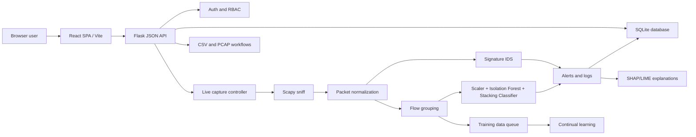

# HOLMES IDS Thesis Working Draft

This file applies the attached thesis master prompt to the actual HOLMES IDS project in this repository. It is a working thesis draft and production plan, not the final department-formatted submission. Items marked `VERIFY`, `INSERT`, or `TO BE COMPLETED` must be confirmed by the student team before submission.

Planning date: 2026-06-06  
Language: English (en-US)  
Citation style target: IEEE  

## Section A - Missing Inputs Checklist

| Missing input | Why it matters | Example of what the students should provide |
|---|---|---|
| Final project title | Controls title page, abstract, chapter wording, and figure captions | `HOLMES IDS: A Hybrid Intrusion Detection System Using Signature-Based and Anomaly-Based Detection` |
| Institution name | Required on title page and declaration pages | `VERIFY: Helwan University / Faculty of Computers and Artificial Intelligence` |
| Department name | Required by most graduation project templates | `Information Systems Department` |
| Supervisor formatting preference | Prevents formatting conflicts late in the process | Word template, margins, font, line spacing, cover-page format |
| Final project scope | Avoids claiming features that were not delivered | Include or exclude TLS decryption, continual learning, analytics, live capture |
| Final validated metrics | Prevents fabricated result claims | Accuracy, F1, precision, recall, unknown detection, false positives, screenshots of run logs |
| Final dataset evidence | Supports ML methodology and result discussion | CIC-IDS-2017 file names, preprocessing steps, train/test split, sample counts |
| Final screenshots | Needed for UI chapter and appendix | Login, dashboards, CSV upload, PCAP upload, rules, live capture, explainability, retraining |
| Final diagrams | Needed for design chapter and list of figures | Mermaid, PlantUML, draw.io, Visio, Figma, or screenshots from UML folder |
| Testing evidence | Required for testing chapter | `pytest` output, Vite build output, manual test tables, PCAP/CSV test runs |
| Deployment environment | Makes implementation and reproducibility concrete | Windows version, Python version, Node version, Npcap/Wireshark versions |
| GitHub repository URL | Needed for appendix manifest | `https://github.com/Mazen2004212/Holmes-IDS-Helwan` |

Proceeding assumption: the thesis is about the existing HOLMES IDS repository, a hybrid intrusion detection system with a Flask backend, React frontend, SQLite database, Scapy packet processing, signature rules, ML anomaly detection, explainability, continual learning, analytics, and role-based access control.

## Section B - Evidence Boundary

This draft uses only project evidence visible in the repository and clearly marks items needing verification. The repository currently contains:

- Backend files such as `UI.py`, `api_auth.py`, `api_routes.py`, `DB.py`, `auth.py`, `signature_IDS.py`, `anomaly_IDS.py`, `live_capture.py`, `packet.py`, `flow.py`, `rule.py`, `RuleProcessor.py`, `explainability.py`, `continual_learning.py`, `analytics.py`, and `tls_decrypt.py`.
- Frontend files under `frontend/src`, built with React, Vite, React Router, Bootstrap, Chart.js, and Font Awesome.
- Model artifacts under `Models/Models`, `Models/Scaler`, `Models/Label Encoder`, and `Models/Features_Order`.
- CIC-style datasets under `Models/Dt` and test CSV files under `Models/test` and `Models/ML/ML_Test`.
- UML source files under `UML`.
- Existing documentation files `README.md`, `holmes_ids_documentation.md`, and `HOLMES_IDS_DETAILED_PROJECT_REPORT.md`.

Integrity rule: do not submit the performance figures in this draft unless they are regenerated and verified from the final repository state. Existing project documentation reports approximately 99.74 percent weighted classifier metrics, approximately 99.85 percent attack detection in the full pipeline, approximately 94.35 percent benign accuracy, and 100/100 simulated unknown detection in `evaluate_anomaly.py`; these must be treated as repository-reported results requiring final reproduction.

## Section C - Thesis Blueprint Overview

The thesis should follow an engineering research structure. The logic is:

1. Define the network security problem and the limitations of single-method IDS designs.
2. Review intrusion detection, signature matching, flow-based ML detection, explainability, and continual learning.
3. Derive requirements for a graduation-level IDS platform.
4. Present the HOLMES IDS architecture and explain why a hybrid design was selected.
5. Document implementation across backend, frontend, database, detection engines, ML pipeline, explainability, live capture, and retraining.
6. Evaluate the system with unit tests, integration tests, build verification, model metrics, PCAP/CSV workflows, and manual UI tests.
7. Discuss results carefully, including limitations such as dataset bias, live-traffic differences, dependency on Npcap/libpcap, and explainability limitations.

The 120-180 page target should be reached with evidence, not padding:

- Main chapters should contain requirements, architecture rationale, technical method, implementation explanation, testing, and measured findings.
- Appendices should hold long code listings, screenshots, raw test logs, dataset schema, command outputs, and installation details.
- Diagrams should be used where they clarify architecture, flows, database relationships, user workflows, and evaluation logic.

Project category fit:

- Software system: yes, because the project has a Flask API, React SPA, SQLite database, and user roles.
- AI/ML system: yes, because it uses a stacking classifier, Isolation Forest, scaler, label encoder, and CIC-style flow features.
- Data project: yes, because it depends on network-flow feature extraction, datasets, labels, preprocessing, and evaluation metrics.
- Web application: yes, because it provides dashboards, uploads, admin, explainability, retraining, and analytics pages.
- Network/security project: yes, because it captures packets, analyzes PCAPs, detects attacks, and uses security controls.
- Embedded/IoT system: no, unless the supervisor asks for an IoT deployment scenario.
- General information system: partially, because it includes authentication, roles, persistence, reports, and user workflows.

## Section D - Chapter Length Table

| Chapter or part | Target page range | Purpose | Key deliverables or evidence |
|---|---:|---|---|
| Front matter | 8-12 | Establish formal thesis metadata | Title page, abstract, executive summary, acknowledgments, contents, figures, tables, abbreviations |
| Chapter 1: Introduction and Project Framing | 10-14 | Explain the problem, aims, scope, and contribution | Problem statement, objectives, scope, contributions, chapter map |
| Chapter 2: Background and Literature Review | 16-24 | Establish technical and research context | IDS concepts, signature IDS, anomaly IDS, ML, XAI, related systems, gap synthesis |
| Chapter 3: Requirements and Methodology | 12-16 | Define what the system must do and how it is evaluated | Stakeholders, requirements, constraints, methodology, metrics, acceptance criteria |
| Chapter 4: Architecture and System Design | 16-22 | Present the designed solution | Architecture diagrams, data flow, database schema, API overview, security design |
| Chapter 5: Implementation | 14-20 | Explain how the system was built | Backend, frontend, detection engines, ML artifacts, explainability, retraining, deployment |
| Chapter 6: Testing and Experimental Setup | 14-20 | Show how correctness and performance are checked | Test strategy, environment, unit/integration/system tests, datasets, build checks |
| Chapter 7: Results and Discussion | 12-18 | Interpret measured outcomes and limitations | Result tables, charts, confusion matrix, alert examples, limitations, threat analysis |
| Chapter 8: Conclusion, Limitations, and Future Work | 6-10 | Summarize contribution and next steps | Objectives achieved, limitations, future work |
| References | 4-8 | Support claims with credible sources | IEEE reference list, verified URLs/DOIs |
| Appendices | 8-16 | Preserve supporting detail | Code excerpts, screenshots, logs, dataset schema, install guide, AI disclosure if required |

## Section E - Complete Thesis Draft

### Title Page Content

`[PROJECT TITLE: VERIFY FINAL TITLE]`

Final Year Graduation Project Thesis

Authors:

- Mohamed Ahmed Abdelfattah
- Mazen Ibrahim Abdelrazek
- Mohamed Abdelgawad Abdelrahman
- Hala Mazen Waddad
- Sohaila Mustafa Abdelfattah

Supervisor:

- Dr. Soha Ehsan

Institution: `[INSTITUTION NAME - VERIFY]`  
Department: `[DEPARTMENT NAME - VERIFY]`  
Submission date: `[MONTH YEAR]`

### Abstract

This thesis presents HOLMES IDS, a hybrid intrusion detection system designed to improve network attack monitoring through the combined use of signature-based detection, machine-learning anomaly detection, live packet capture, explainable alert analysis, and continual learning. Conventional signature-only systems are effective for known attacks but are limited when attack behavior changes or when previously unseen traffic patterns appear. Purely data-driven systems can identify abnormal behavior, but they may produce uncertain classifications and often require additional explanation for operational use. HOLMES IDS addresses this engineering gap by integrating rule-based packet inspection with flow-based anomaly classification using saved machine-learning artifacts, an Isolation Forest outlier detector, and a stacked classifier. The system is implemented as a Flask JSON API backend with a React and Vite frontend, SQLite persistence, role-based access control, CSV and PCAP analysis workflows, SHAP/LIME explanation support, and a human-in-the-loop retraining workflow. Evaluation evidence must be inserted from the final validated project run. Repository documentation currently reports high CIC-style dataset performance, but these values must be independently reproduced before final submission. The thesis documents the requirements, architecture, implementation, testing strategy, results templates, limitations, and future improvements needed to position HOLMES IDS as a practical graduation-level cybersecurity system.

### Executive Summary

HOLMES IDS is a graduation project that implements a web-based hybrid intrusion detection platform. The system combines deterministic signature rules for known attacks with anomaly-based machine learning for unknown or unusual network behavior. Its backend is written in Python using Flask and Flask-Login, while the frontend is a React single-page application built with Vite. SQLite stores rules, alerts, logs, users, explanation features, training samples, and retraining jobs. The project also includes live capture using Scapy, offline PCAP analysis, CSV-based anomaly prediction, SHAP/LIME explainability, TLS metadata/decryption support through tshark where available, analytics queries, and role-based access control.

The engineering value of the project is not only in the detection methods but also in their integration. Signature detection provides fast pattern matching against known behavior. The anomaly workflow extracts flow features, scales them, checks Isolation Forest scores, and applies a trained stacked classifier to label flows. Explainability stores alert feature vectors so analysts can inspect why a model produced a result. Continual learning stores live flow samples, allows human relabeling, retrains candidate models, evaluates them, and promotes only models that satisfy configured quality gates.

This draft treats project-specific measurements cautiously. The final thesis must include verified metrics from `evaluate_anomaly.py`, test command outputs, frontend build results, manual workflow checks, screenshots, and any supervisor-approved formatting rules. If the department does not require an executive summary, this section can be removed without affecting the normal thesis structure.

### Acknowledgments

The authors would like to thank Dr. Soha Ehsan for supervising this graduation project and for providing academic guidance throughout the design and implementation stages. The authors also acknowledge the support of their department, colleagues, and families. Final acknowledgments should be revised by the student team to match institutional expectations and personal preferences.

### Table of Contents

1. Introduction and Project Framing  
2. Background and Literature Review  
3. Requirements and Methodology  
4. Architecture and System Design  
5. Implementation  
6. Testing and Experimental Setup  
7. Results and Discussion  
8. Conclusion, Limitations, and Future Work  
References  
Appendices

### List of Figures

| Figure | Title | Status |
|---|---|---|
| Figure 1.1 | HOLMES IDS problem context | Placeholder |
| Figure 4.1 | High-level system architecture | Existing Mermaid draft available in documentation |
| Figure 4.2 | Backend component architecture | To be rendered from repository modules |
| Figure 4.3 | Live capture and anomaly detection data flow | To be rendered |
| Figure 4.4 | Database schema / ER diagram | To be rendered |
| Figure 4.5 | Role-based access workflow | To be rendered |
| Figure 5.1 | Frontend page map | To be rendered |
| Figure 6.1 | Evaluation workflow | To be rendered |

### List of Tables

| Table | Title | Status |
|---|---|---|
| Table 2.1 | Comparison of signature-based, anomaly-based, and hybrid IDS methods | Drafted |
| Table 3.1 | Functional requirements | Drafted |
| Table 3.2 | Non-functional requirements | Drafted |
| Table 3.3 | Requirement traceability matrix | Drafted |
| Table 4.1 | Component responsibility matrix | Drafted |
| Table 5.1 | Technology stack | Drafted |
| Table 6.1 | Test cases | Template |
| Table 7.1 | Model evaluation metrics | Template requiring final values |

### List of Abbreviations

| Abbreviation | Meaning |
|---|---|
| API | Application Programming Interface |
| CSV | Comma-Separated Values |
| DB | Database |
| IDS | Intrusion Detection System |
| ML | Machine Learning |
| PCAP | Packet Capture |
| RBAC | Role-Based Access Control |
| SHAP | SHapley Additive exPlanations |
| LIME | Local Interpretable Model-Agnostic Explanations |
| SPA | Single-Page Application |
| TLS | Transport Layer Security |
| UI | User Interface |
| XAI | Explainable Artificial Intelligence |

## Chapter 1 - Introduction and Project Framing

### 1.1 Problem Context

Modern networks generate large volumes of heterogeneous traffic from users, servers, applications, cloud services, and connected devices. This traffic can contain normal business activity, misconfigurations, scanning behavior, credential attacks, denial-of-service patterns, and exploit attempts. An intrusion detection system is therefore expected to identify suspicious traffic quickly while minimizing false alarms and presenting enough explanation for analysts to act responsibly.

Signature-based IDS tools are valuable because they match known malicious patterns with deterministic rules. However, they depend on rule coverage and are less effective when attacks change their payloads, ports, timing, or behavior. Machine-learning anomaly detection can identify unusual patterns in flow features, but model predictions can be hard to interpret and may not transfer cleanly from benchmark datasets to real traffic. HOLMES IDS is motivated by this tension: effective detection requires both known-pattern recognition and adaptive anomaly analysis.

### 1.2 Research/Engineering Gap

The engineering gap addressed by HOLMES IDS is the lack of a compact graduation-level platform that integrates several IDS capabilities into one traceable system: signature detection, ML anomaly detection, live capture, offline PCAP and CSV analysis, explainable alert inspection, human-in-the-loop retraining, role-based access, and operational analytics. The project does not claim to replace enterprise security monitoring tools. Instead, it demonstrates how a hybrid IDS can be designed, implemented, tested, and documented using accessible open-source technologies.

### 1.3 Aim

The aim of the project is to design and implement a hybrid intrusion detection system that combines signature-based and anomaly-based detection workflows in a web application suitable for educational, experimental, and prototype security-monitoring use.

### 1.4 Measurable Objectives

1. Implement a backend API capable of authentication, role-based access control, alert storage, rule retrieval, uploads, live capture control, explainability, analytics, and retraining operations.
2. Implement a React frontend that exposes dashboards for signature alerts, anomaly alerts, live capture, uploads, rules, analytics, user administration, explainability, and retraining.
3. Implement signature-based detection over packet data using stored rules and packet normalization.
4. Implement anomaly-based detection using flow features, scaling, Isolation Forest scoring, and a trained stacked classifier.
5. Support offline CSV and PCAP analysis workflows.
6. Support live capture through Scapy on compatible network interfaces.
7. Store feature vectors for explanation and retraining workflows.
8. Evaluate the project using reproducible tests and measured ML metrics.

### 1.5 Scope and Exclusions

In scope:

- Local Flask backend and React frontend deployment.
- SQLite persistence.
- Signature rules and rule loading.
- CSV anomaly prediction.
- PCAP signature analysis.
- Live packet capture where Npcap/libpcap is installed and permissions allow capture.
- SHAP/LIME explanation for stored anomaly-alert features.
- Human relabeling and retraining workflow.
- Analytics query builder.

Out of scope unless explicitly verified:

- Production-scale distributed IDS deployment.
- Cloud-native SIEM integration.
- Guaranteed zero-day detection.
- Formal security certification.
- Real-time high-throughput packet processing at enterprise scale.
- Full TLS content decryption without valid key material and tshark support.

### 1.6 Contributions of the Project

The project contributes:

- A hybrid IDS prototype integrating signature and anomaly detection.
- A web interface for security analysts and administrators.
- A flow-based ML pipeline using saved model artifacts.
- A live capture loop with background flow processing and training-data capture.
- Explainability support using stored alert features.
- A continual-learning workflow with human labels, retraining, evaluation gates, model promotion, and rollback.
- A structured documentation base for future evaluation and extension.

### 1.7 Organization of the Thesis

Chapter 2 reviews IDS concepts, signature detection, anomaly detection, flow-based ML, XAI, and related systems. Chapter 3 defines requirements, assumptions, constraints, methodology, and evaluation criteria. Chapter 4 presents the architecture, data model, workflows, API boundaries, and design decisions. Chapter 5 documents implementation details. Chapter 6 presents the testing and experimental setup. Chapter 7 discusses verified results and limitations. Chapter 8 concludes the thesis and proposes future work.

## Chapter 2 - Background and Literature Review

### 2.1 Intrusion Detection Systems

An intrusion detection system monitors host or network activity to identify signs of unauthorized, suspicious, or harmful behavior. Network IDS designs typically analyze packets, flows, or logs. Host-based IDS designs observe file changes, processes, authentication events, and endpoint telemetry. HOLMES IDS is primarily network-oriented because it analyzes packets, PCAP files, and flow features.

### 2.2 Signature-Based Detection

Signature detection identifies known attacks using rules. A rule may match protocol, source or destination address, ports, payload content, flags, packet size, or threshold behavior. The strength of this approach is precision for known patterns. Its limitation is dependence on complete and updated rule coverage. In HOLMES IDS, `rule.py`, `match_rule.py`, `RuleProcessor.py`, and `signature_IDS.py` implement the core signature workflow.

### 2.3 Anomaly-Based Detection

Anomaly detection attempts to identify behavior that differs from learned normal or known patterns. HOLMES IDS uses flow features, a scaler, an Isolation Forest, and a stacked classifier. Isolation Forest provides an outlier score, while the classifier assigns a known attack or benign label. This design gives the system a mechanism for both known-class classification and unknown-pattern flagging.

### 2.4 Explainable Machine Learning

Explainability is important in security because alerts should be understandable, auditable, and actionable. HOLMES IDS stores feature vectors in `alert_features` so explanations can be generated after an alert is created. SHAP and LIME are used as complementary explanation approaches. The final thesis must clarify that these explanations support classifier interpretation and may not fully explain the Isolation Forest score itself.

### 2.5 Continual Learning

Network behavior changes over time. A static model may gradually become less accurate if traffic distribution shifts. HOLMES IDS includes a continual learning workflow that stores flow features, allows human labels, retrains candidate models, evaluates them, and promotes models only if they satisfy quality gates. This workflow is implemented mainly in `continual_learning.py`.

### 2.6 Comparative Literature/System Table Template

| Approach family | What it does | Strengths | Limitations | Relevance to HOLMES IDS |
|---|---|---|---|---|
| Signature IDS | Matches known patterns | Fast, interpretable, deterministic | Weak against unseen variants | Used for known attack detection |
| ML classifier IDS | Learns labeled attack categories | Can detect complex feature patterns | Needs labeled data and validation | Used for CIC-style flow classification |
| Outlier/anomaly IDS | Flags unusual samples | Can detect unknown behavior | Higher false-positive risk | Isolation Forest supports unknown attack flagging |
| Explainable IDS | Adds model explanation | Improves analyst trust | Explanations can be approximate | SHAP/LIME explain classifier decisions |
| Continual-learning IDS | Updates from feedback | Adapts to drift | Requires labels and governance | Human labels guide retraining |

### 2.7 Identified Gap

The gap is not that any individual technique is new. The gap is the integrated engineering of these techniques into a coherent, testable, graduation-level system. HOLMES IDS addresses this by combining detection, explanation, retraining, analytics, and role-based workflows in one application.

## Chapter 3 - Requirements and Methodology

### 3.1 Stakeholders

| Stakeholder | Interest |
|---|---|
| Administrator | Manage users, roles, rules, retraining, and system configuration |
| Signature analyst | Review signature alerts, upload PCAP files, inspect rules |
| Anomaly analyst | Review anomaly alerts, upload CSV feature files, inspect explanations |
| Live operator | Start, stop, and monitor live capture |
| Supervisor/evaluator | Review architecture, implementation, testing, and results |

### 3.2 Functional Requirements

| ID | Requirement | Evidence source |
|---|---|---|
| FR-01 | The system shall authenticate users. | `api_auth.py`, `auth.py`, `frontend/src/context/AuthContext.jsx` |
| FR-02 | The system shall enforce role-based access. | `auth.py`, `api_routes.py`, frontend protected routes |
| FR-03 | The system shall display signature alerts and logs. | `api_routes.py`, `SignaturePage.jsx` |
| FR-04 | The system shall display anomaly alerts and logs. | `api_routes.py`, `AnomalyPage.jsx` |
| FR-05 | The system shall process CSV uploads for anomaly prediction. | `api_routes.py`, `anomaly_IDS.py` |
| FR-06 | The system shall process PCAP uploads for signature detection. | `api_routes.py`, `signature_IDS.py` |
| FR-07 | The system shall support live capture where packet capture drivers are available. | `live_capture.py`, Scapy dependency |
| FR-08 | The system shall store alerts, logs, rules, users, explanation features, training data, and retrain jobs. | `DB.py` |
| FR-09 | The system shall produce SHAP/LIME explanations for anomaly alerts where feature data exists. | `explainability.py` |
| FR-10 | The system shall support human labeling and candidate model retraining. | `continual_learning.py`, `RetrainPage.jsx` |
| FR-11 | The system shall provide analytics queries without exposing raw SQL. | `analytics.py`, `AnalyticsPage.jsx` |

### 3.3 Non-Functional Requirements

| ID | Requirement | Rationale |
|---|---|---|
| NFR-01 | Usability | Analysts must use dashboards without reading code |
| NFR-02 | Maintainability | Detection logic, API routes, and frontend pages should remain modular |
| NFR-03 | Reproducibility | Tests, model evaluation, and setup steps must be repeatable |
| NFR-04 | Security | Authentication, roles, password hashing, upload validation, and CSRF controls reduce risk |
| NFR-05 | Explainability | ML alerts should include interpretable feature explanations where possible |
| NFR-06 | Performance | Batch prediction and live capture should avoid blocking the UI |
| NFR-07 | Portability | Local installation should run on Windows with Npcap or Linux with libpcap |

### 3.4 Assumptions and Constraints

Assumptions:

- Users have permission to analyze network traffic.
- Packet capture drivers are installed for live capture.
- Model artifacts match the expected feature order.
- Dataset-derived metrics are not automatically equivalent to live-network performance.

Constraints:

- SQLite is suitable for prototype and local use but not high-volume enterprise ingestion.
- Scapy live capture on Windows depends on Npcap/WinPcap-compatible packet capture support.
- SHAP/LIME explanation speed can be limited for complex models.
- The repository contains large datasets and model artifacts that may affect version-control practices.

### 3.5 Methodology

The project follows an applied engineering methodology:

1. Define IDS requirements and user roles.
2. Implement packet and flow abstraction.
3. Implement signature matching rules.
4. Load trained ML artifacts and apply them to flow features.
5. Build backend APIs and database persistence.
6. Build frontend dashboards and workflows.
7. Add explainability, analytics, and retraining support.
8. Validate through tests, build checks, manual workflows, and model evaluation.

### 3.6 Evaluation Metrics

| Metric | Applies to | Final status |
|---|---|---|
| Accuracy | Classifier and full pipeline | INSERT verified value |
| Weighted F1 | Classifier and retraining gate | INSERT verified value |
| Precision | Classifier | INSERT verified value |
| Recall | Classifier | INSERT verified value |
| Confusion matrix | Per-class analysis | INSERT verified figure |
| Unknown detection count | Isolation Forest simulated unknown test | INSERT verified value |
| Benign accuracy | Full pipeline | INSERT verified value |
| Frontend build success | React/Vite UI | INSERT command output |
| Backend compile/test status | Python backend | INSERT command output |
| Manual workflow pass/fail | UI and API flows | INSERT test table |

## Chapter 4 - Architecture and System Design

### 4.1 Overall Architecture

HOLMES IDS uses a client-server architecture. The React SPA sends requests to a Flask backend. Flask routes and blueprints coordinate authentication, data retrieval, upload processing, live capture control, explainability, retraining, and analytics. SQLite stores runtime records. Detection modules operate on packet objects, flow features, rules, and model artifacts.



Caption draft: Figure 4.1 shows the main HOLMES IDS components and the data flow between the React frontend, Flask backend, detection engines, database, explainability module, and retraining workflow.

### 4.2 Component Responsibility Matrix

| Component | Responsibility |
|---|---|
| `UI.py` | Flask app startup, model loading, blueprint registration, legacy routes, database initialization |
| `api_auth.py` | JSON authentication, session handling, CSRF token generation |
| `api_routes.py` | JSON API for dashboards, uploads, live capture, admin, explanations, retraining, analytics |
| `DB.py` | SQLite connection and table creation |
| `auth.py` | User model, password hashing, roles, access decorators |
| `packet.py` | Scapy packet normalization |
| `flow.py` | Flow grouping and 20-feature computation |
| `rule.py` | Rule representation and match logic |
| `signature_IDS.py` | Signature prediction over PCAP/live packets |
| `anomaly_IDS.py` | CSV/flow anomaly prediction |
| `live_capture.py` | Background packet sniffing, signature checks, flow batching, feature writing |
| `explainability.py` | SHAP/LIME explanation and feature storage |
| `continual_learning.py` | Training data labeling, retraining, promotion, rollback |
| `analytics.py` | Safe query builder and detection-pattern analytics |

### 4.3 Database Design

The database stores operational and learning records. Core tables are:

- `rules`: signature rule definitions.
- `logs`: event records generated by signature or anomaly workflows.
- `alerts`: analyst-facing alert records.
- `users`: username, password hash, and role.
- `alert_features`: raw feature vectors linked to anomaly alerts.
- `training_data`: feature vectors stored for human labeling and retraining.
- `retrain_jobs`: retraining execution state and comparison metrics.

ER diagram placeholder:

`[USER-SUPPLIED DIAGRAM HERE - Figure 4.4 Database schema showing rules, logs, alerts, users, alert_features, training_data, retrain_jobs, primary keys, foreign keys, and cardinalities.]`

### 4.4 Live Capture Design

The live capture system runs background threads:

- `_capture_loop`: invokes Scapy `sniff()` with a timeout loop.
- `_flow_processing_loop`: drains buffered packets every configured window and computes flow features.
- `_batch_writer_loop`: writes accumulated training features to SQLite in batches.

The design avoids performing all anomaly analysis inside the packet callback. This separation reduces callback work and keeps packet capture, flow processing, and database writing organized.

### 4.5 Security Design

The project includes:

- Password hashing through Werkzeug.
- Flask-Login sessions.
- Role-based route protection.
- Upload extension allowlists.
- Parameterized database queries in core paths.
- Query builder restrictions that avoid raw SQL exposure.
- CSRF token support in the frontend client and authentication logout path.

Security limitations requiring discussion:

- Default `admin/admin` credentials are acceptable only for local demonstration and must be changed in real deployment.
- A fallback Flask secret key should be replaced by an environment variable in production.
- CSRF protection should be consistently applied to all mutating API routes before production exposure.
- Live packet capture requires administrator permission and must comply with legal and ethical constraints.

## Chapter 5 - Implementation

### 5.1 Technology Stack

| Layer | Technologies |
|---|---|
| Backend | Python, Flask, Flask-Login, Werkzeug, SQLite |
| Packet processing | Scapy, Npcap/libpcap dependency |
| Data/ML | pandas, NumPy, scikit-learn, CatBoost, joblib, MinMaxScaler, LabelEncoder |
| Explainability | SHAP, LIME, matplotlib |
| Frontend | React, Vite, React Router, Bootstrap, Font Awesome, Chart.js |
| Testing | pytest, Vite production build |
| TLS support | tshark/Wireshark where installed |

### 5.2 Backend Implementation

The Flask backend loads model artifacts during startup and stores them in `app_state`. It registers authentication and application blueprints, initializes database tables, ensures an administrator account exists, and loads rules from the database. JSON routes under `/api` support the React frontend. The backend also retains legacy server-rendered routes, which should be described as backward-compatible or transitional implementation detail.

### 5.3 Frontend Implementation

The React frontend uses `AuthContext` to track authenticated users and protected routes to restrict pages by role. The main pages include login, signature dashboard, anomaly dashboard, CSV upload, PCAP upload, rules, live capture, admin, explanation, retraining, and analytics. The API client centralizes credential handling, JSON conversion, file uploads, and CSRF token attachment for mutating requests.

### 5.4 Signature Detection Implementation

Signature detection normalizes packets into a consistent `Packet` representation, loads stored rules, constructs `Rule` objects, and checks packet properties and options. When a rule matches, the system creates log and alert records. PCAP processing supports parallel packet evaluation.

### 5.5 Anomaly Detection Implementation

The anomaly pipeline computes or accepts CIC-style flow features, aligns columns to the saved feature order, scales features, evaluates Isolation Forest scores, and applies the classifier for known-label prediction. If the Isolation Forest flags a row or flow as unknown, the system can label it as `Unknown Attack`. Final wording must reflect the exact behavior of the active code version.

### 5.6 Explainability Implementation

Feature vectors are stored when anomaly alerts are created. The explanation endpoint retrieves these vectors and generates SHAP and LIME outputs where supported. The final thesis should include screenshots and a short discussion of limitations, especially where explanations describe the classifier path more directly than the Isolation Forest path.

### 5.7 Continual Learning Implementation

The continual learning workflow stores live flow features, exposes samples for human labeling, merges labeled samples with the training dataset, retrains the classifier and Isolation Forest, evaluates candidate models, and promotes them if thresholds are met. The promotion gate reported in documentation uses weighted F1 and false-positive-rate criteria. Final values must be verified from `continual_learning.py`.

### 5.8 Deployment and Run Process

Backend:

```powershell
python -m venv .venv
.\.venv\Scripts\activate
pip install -r requirements.txt
python UI.py
```

Frontend:

```powershell
cd frontend
npm install
npm run dev
```

Live capture on Windows requires Npcap. If Scapy reports that WinPcap is not installed, install Npcap with WinPcap API-compatible mode enabled and restart the backend, preferably from an Administrator terminal.

## Chapter 6 - Testing and Experimental Setup

### 6.1 Testing Strategy

Testing should combine automated and manual evidence:

- Python syntax and unit tests for backend modules.
- React production build.
- API endpoint checks for login, dashboards, upload workflows, live status, admin, explainability, retraining, and analytics.
- Model evaluation through `evaluate_anomaly.py`.
- Manual UI screenshots and workflow recordings.
- PCAP and CSV test case runs.
- Negative tests for unsupported uploads, invalid login, insufficient permissions, and missing packet-capture driver.

### 6.2 Environment Template

| Item | Value |
|---|---|
| Operating system | INSERT actual OS |
| Python version | INSERT actual version |
| Node.js version | INSERT actual version |
| Backend command | `python UI.py` |
| Frontend command | `npm run dev` or `npm run build` |
| Packet capture driver | Npcap on Windows or libpcap on Linux |
| Database | SQLite file under `DB/IDS.db` |
| Browser | INSERT browser/version |

### 6.3 Test Case Template

| Test ID | Scenario | Steps | Expected result | Actual result | Status |
|---|---|---|---|---|---|
| TC-01 | Login with valid admin | Open login, enter valid credentials | Redirect to default dashboard | INSERT | INSERT |
| TC-02 | Login with invalid password | Enter wrong password | Error message, no session | INSERT | INSERT |
| TC-03 | Signature dashboard loads | Login as admin/signature analyst | Alerts, logs, and rules load | INSERT | INSERT |
| TC-04 | CSV anomaly upload | Upload valid CIC-style CSV | Predictions and stats returned | INSERT | INSERT |
| TC-05 | PCAP upload | Upload valid PCAP | Signature alerts returned | INSERT | INSERT |
| TC-06 | Live capture without Npcap | Start capture on Windows without Npcap | Clear capture error displayed | Verified during debugging; insert screenshot |
| TC-07 | Live capture with Npcap | Start capture after installing Npcap | Running status and packet count | INSERT |
| TC-08 | Explanation page | Open anomaly alert explanation | SHAP/LIME details shown where possible | INSERT |
| TC-09 | Retraining start | Start retrain as admin | Background job status updates | INSERT |
| TC-10 | Frontend build | Run `npm run build` | Build succeeds | INSERT output |

### 6.4 Reproducibility Notes

The final thesis should include exact command outputs in Appendix C. It should also record dependency versions, dataset filenames, model artifact paths, and whether tests were run inside the virtual environment.

## Chapter 7 - Results and Discussion

### 7.1 Result Reporting Policy

Do not fabricate results. If a result has not been reproduced from the final codebase, leave it as `INSERT VALIDATED RESULT`.

### 7.2 Model Evaluation Table

| Metric | Repository-reported value | Final reproduced value | Evidence location |
|---|---:|---:|---|
| Stacking classifier accuracy | About 99.74 percent | INSERT | `evaluate_anomaly.py` output |
| Weighted F1 | About 99.74 percent | INSERT | `evaluate_anomaly.py` output |
| Weighted precision | About 99.74 percent | INSERT | `evaluate_anomaly.py` output |
| Weighted recall | About 99.74 percent | INSERT | `evaluate_anomaly.py` output |
| Full pipeline attack detection rate | About 99.85 percent | INSERT | `evaluate_anomaly.py` output |
| Full pipeline benign accuracy | About 94.35 percent | INSERT | `evaluate_anomaly.py` output |
| Unknown sample detection | 100/100 | INSERT | `evaluate_anomaly.py` output |

### 7.3 Discussion Template

If the reproduced values match the repository-reported values, the discussion should state that the model performs strongly on the available CIC-style evaluation data. However, the thesis must avoid claiming equivalent live-network performance. CIC-style datasets are structured benchmark data, while live network traffic can differ in protocols, timing, feature distribution, background noise, and capture quality.

### 7.4 Failure and Limitation Analysis

Key limitations:

- Dataset generalization risk: benchmark traffic may not represent all real environments.
- Live capture dependency: Windows live capture requires Npcap/WinPcap-compatible support.
- SQLite scalability: sufficient for prototype use, not for enterprise telemetry volume.
- Explainability scope: SHAP/LIME support classifier explanation but may not fully explain Isolation Forest outlier reasoning.
- Security hardening: default admin credentials, fallback secret key, and partial CSRF coverage require production hardening.
- Model governance: continual learning requires careful human labeling and rollback control.

## Chapter 8 - Conclusion, Limitations, and Future Work

HOLMES IDS demonstrates a hybrid approach to network intrusion detection by integrating signature rules, flow-based machine learning, live capture, offline uploads, explainability, analytics, user roles, and continual learning in one web application. The project shows how multiple security and data-science techniques can be combined into an operational prototype with clear modules and user workflows.

The main contribution is an integrated engineering implementation rather than a claim of a new IDS algorithm. The system provides a practical environment for testing signature detection, anomaly detection, explanation, and retraining concepts. Its limitations include dataset dependency, local deployment assumptions, packet-capture driver requirements, prototype database scalability, and security hardening needs.

Future work should include production-grade secret management, full CSRF enforcement across mutating routes, more extensive benchmark comparisons, live-traffic validation, improved model drift monitoring, dashboard-level alert triage, exportable reports, containerized deployment, centralized logging, and integration with external threat-intelligence or SIEM systems.

## References - Initial Verified Source Plan

The following are source slots and starting references. Final submission must verify all bibliographic details and format them in IEEE style.

1. I. Sharafaldin, A. H. Lashkari, and A. A. Ghorbani, "CICIDS2017: A Contemporary Dataset for Intrusion Detection," 2018. Verify final venue, DOI, and page numbers from the original publication before submission.
2. M. T. Ribeiro, S. Singh, and C. Guestrin, "`Why Should I Trust You?`: Explaining the Predictions of Any Classifier," 2016.
3. S. M. Lundberg and S.-I. Lee, "A Unified Approach to Interpreting Model Predictions," NeurIPS, 2017.
4. Scapy official documentation, packet manipulation and sniffing reference. Use for Scapy behavior, not for IDS theory.
5. Flask official documentation, Flask 3.1.x. Use for Flask, blueprints, routing, sessions, security considerations, and testing.
6. React official documentation. Use for React component and SPA concepts.
7. scikit-learn official documentation for `IsolationForest`, `StackingClassifier`, and related estimators.
8. Npcap official documentation. Use for Windows packet capture dependency and WinPcap compatibility discussion.
9. Wireshark/tshark official documentation. Use only if TLS metadata/decryption workflow is included in final scope.
10. OWASP or comparable web security guidance. Use for authentication, CSRF, upload handling, and security limitations if approved by supervisor.

## Appendices Plan

| Appendix | Content |
|---|---|
| Appendix A | Selected code listings for backend, frontend API client, detection logic, and retraining |
| Appendix B | Dataset description, feature order, preprocessing notes, and label schema |
| Appendix C | Test logs, command outputs, build output, `pytest` output, model evaluation output |
| Appendix D | UI screenshots for each major workflow |
| Appendix E | Installation and user manual |
| Appendix F | Diagram source files and exported images |
| Appendix G | Security and ethical-use notes |
| Appendix H | AI-use disclosure if required by the institution |
| Appendix I | Repository manifest and dependency list |

## Section F - Required Diagram Inventory and Production Instructions

| Figure | Title | Type | Placement | Purpose | Required elements | Tool | Export | Caption draft | Status |
|---|---|---|---|---|---|---|---|---|---|
| Figure 1.1 | HOLMES IDS problem context | Context diagram | Chapter 1 | Show environment and threat-monitoring need | Network traffic, analysts, IDS, alerts, datasets | draw.io/Mermaid | SVG/PDF/PNG | Problem context motivating HOLMES IDS | Student-supplied |
| Figure 4.1 | High-level architecture | Architecture diagram | Chapter 4 | Show frontend, backend, DB, detection engines | React, Flask API, SQLite, Scapy, signature IDS, anomaly IDS, explainability, retraining | Mermaid/draw.io | SVG/PDF/PNG | High-level HOLMES IDS architecture | AI-renderable |
| Figure 4.2 | Component/container diagram | Component diagram | Chapter 4 | Show module boundaries | Main Python modules, frontend pages, API blueprints | draw.io | SVG/PDF/PNG | Component organization of HOLMES IDS | Student-supplied |
| Figure 4.3 | Live capture data flow | Data-flow diagram | Chapter 4 | Show live packet path | sniff, Packet, rules, buffer, Flow, ML, DB, training queue | Mermaid/draw.io | SVG/PDF/PNG | Live capture and anomaly processing flow | AI-renderable |
| Figure 4.4 | Database ER diagram | ER diagram | Chapter 4 | Show persistence schema | rules, logs, alerts, users, alert_features, training_data, retrain_jobs | draw.io/dbdiagram | SVG/PDF/PNG | SQLite schema used by HOLMES IDS | Student-supplied |
| Figure 4.5 | Role-based access workflow | Sequence/activity diagram | Chapter 4 | Show login and route access | user, frontend, `/api/auth`, session, protected route | Mermaid/PlantUML | SVG/PDF/PNG | Authentication and role-based access flow | AI-renderable |
| Figure 5.1 | Frontend screen map | UI structure map | Chapter 5 | Show UI navigation | login, signature, anomaly, CSV, PCAP, live, admin, explain, retrain, analytics | Figma/draw.io | PNG/SVG | React page structure of HOLMES IDS | Student-supplied |
| Figure 6.1 | Evaluation workflow | Testing workflow | Chapter 6 | Show test evidence pipeline | unit tests, build, PCAP, CSV, model evaluation, manual UI tests | Mermaid/draw.io | SVG/PDF/PNG | Testing and evaluation workflow | AI-renderable |
| Figure 7.1 | Confusion matrix | Result figure | Chapter 7 | Show classifier performance | class labels and counts | Python/matplotlib | PNG/PDF | Confusion matrix from final evaluation run | Student-supplied |

Diagram quality rules:

- Use directional arrows and label protocols or data types where relevant.
- Do not overload one figure with every detail.
- Keep names consistent with code modules and chapter text.
- Export editable source plus submission-ready image.
- Every figure must be referenced in the body text.

## Section G - Chapter-by-Chapter Writing Plan and Timeline

### Table 1 - Chapter Lengths and Target Outputs

| Chapter | Target pages | Output |
|---|---:|---|
| Front matter | 8-12 | Final title page, abstract, executive summary, contents |
| Chapter 1 | 10-14 | Polished problem framing and objectives |
| Chapter 2 | 16-24 | Literature synthesis with verified sources |
| Chapter 3 | 12-16 | Requirements, methodology, acceptance criteria |
| Chapter 4 | 16-22 | Architecture text and diagrams |
| Chapter 5 | 14-20 | Implementation explanation and selected snippets |
| Chapter 6 | 14-20 | Test plan, environment, test outputs |
| Chapter 7 | 12-18 | Verified results and discussion |
| Chapter 8 | 6-10 | Conclusion and future work |
| Appendices | 8-16 | Evidence pack |

### Table 2 - Deliverables and Evidence Needed

| Deliverable | Evidence needed |
|---|---|
| Literature review | Verified papers, official docs, comparative table |
| Architecture chapter | Draw.io/Mermaid/UML diagrams, captions, design rationale |
| Implementation chapter | Repo structure, selected code snippets, screenshots |
| Testing chapter | `pytest`, `py_compile`, `npm run build`, manual test cases |
| Results chapter | Final `evaluate_anomaly.py` output, charts, screenshots |
| Appendices | Logs, commands, screenshots, dependency versions |

### Table 3 - Week-by-Week Timeline Starting 2026-06-06

| Week | Dates | Work |
|---|---|---|
| Week 1 | 2026-06-06 to 2026-06-12 | Confirm template, title, scope, institution details, collect screenshots and metrics |
| Week 2 | 2026-06-13 to 2026-06-19 | Verify literature sources, write Chapters 1-2, create comparison tables |
| Week 3 | 2026-06-20 to 2026-06-26 | Write Chapters 3-4, produce architecture and database diagrams |
| Week 4 | 2026-06-27 to 2026-07-03 | Write Chapter 5, capture code evidence and UI screenshots |
| Week 5 | 2026-07-04 to 2026-07-10 | Run tests, reproduce metrics, write Chapter 6 |
| Week 6 | 2026-07-11 to 2026-07-17 | Write Chapter 7 from actual results, revise limitations |
| Week 7 | 2026-07-18 to 2026-07-24 | Write Chapter 8, appendices, references, supervisor review |
| Week 8 | 2026-07-25 to 2026-07-31 | Final formatting, plagiarism/self-similarity check, reference verification, submission package |

### Table 4 - Diagram Production Timeline

| Diagram group | Deadline | Reviewer |
|---|---|---|
| Architecture and context diagrams | End of Week 3 | Technical lead and supervisor |
| ER/class/data model diagrams | End of Week 3 | Backend/database lead |
| Sequence/activity diagrams | Week 4 | Backend/frontend leads |
| UI screenshots and mockups | Week 4 | Frontend lead |
| Testing and result figures | Week 5-6 | Evaluation lead |

### Table 5 - Risks, Blockers, and Mitigation

| Risk | Impact | Mitigation |
|---|---|---|
| Missing verified metrics | Results chapter becomes weak | Re-run `evaluate_anomaly.py` and store outputs |
| Npcap missing for live capture | Live capture cannot run | Install Npcap with WinPcap compatibility and use admin terminal |
| Large datasets slow testing | Delayed evaluation | Use documented small tests plus final full run |
| Diagram inconsistency | Confusing design chapter | Use a shared naming glossary |
| Unverified references | Academic integrity risk | Verify every source before final submission |
| Formatting mismatch | Late rework | Obtain supervisor/university template early |

## Section H - Primary-Source Bibliography to Consult

| Category | Source type | Why it matters | Evidence supported |
|---|---|---|---|
| IDS datasets | CICIDS2017 paper and official dataset notes | Justifies dataset choice and limitations | Dataset methodology, labels, benchmark context |
| Explainable AI | SHAP and LIME original papers | Supports explanation methods | XAI background and limitations |
| ML algorithms | scikit-learn docs and original algorithm papers | Supports model descriptions | Isolation Forest, Random Forest, stacking |
| Packet processing | Scapy and Npcap docs | Supports live capture implementation | Packet sniffing and Windows dependency |
| Web framework | Flask and React docs | Supports stack explanation | Backend/frontend design |
| Web security | OWASP or official Flask security docs | Supports security controls and limitations | CSRF, sessions, upload risks |
| TLS analysis | Wireshark/tshark docs | Supports TLS metadata/decryption if included | Optional PCAP TLS workflow |

IEEE placeholder template:

`[N] Author Initials. Surname, "Title," Venue or Publisher, vol., no., pp., year, doi/url.`

## Section I - Sample Abstract and Sample Opening Paragraph

### Sample Abstract

This thesis presents HOLMES IDS, a hybrid intrusion detection system designed to address the limitations of isolated signature-based or anomaly-based network monitoring in the context of cybersecurity education and prototype security analysis. The work aims to detect known attack patterns, identify anomalous flow behavior, and support analyst interpretation by employing a Flask backend, React frontend, SQLite persistence layer, Scapy packet processing, signature rules, an Isolation Forest outlier detector, a stacked machine-learning classifier, and SHAP/LIME explanation mechanisms. The study begins by examining the technical background of intrusion detection and related hybrid IDS approaches, then derives system requirements and design constraints. It subsequently documents the proposed architecture, implementation details, and evaluation methodology. Where validated project results are available, performance is analyzed using accuracy, weighted F1, precision, recall, unknown detection counts, and workflow test outcomes. The findings indicate `[INSERT ACTUAL FINDINGS]`, while also revealing limitations related to benchmark dataset generalization, live-capture driver dependencies, and production security hardening. The thesis concludes by outlining practical improvements and future research directions.

### Sample Opening Paragraph

In recent years, networked systems have faced growing demand for monitoring solutions that are not only functionally effective but also explainable, adaptable, and practical to deploy in real operational environments. Despite the availability of signature-based intrusion detection systems and machine-learning classifiers, many current approaches still suffer from limitations related to unseen attacks, false positives, interpretability, and integration complexity. These challenges motivate the development of HOLMES IDS, a graduation project that investigates how signature detection, flow-based anomaly detection, explainability, and continual learning can be integrated into a unified web-based intrusion detection platform. Beyond implementation, the project examines the requirements, architectural decisions, evaluation criteria, and measurable outcomes needed to justify the proposed system from both a technical and practical perspective.

## Final Verification Checklist

- Authors and supervisor are included correctly.
- Institution and department are still placeholders and must be verified.
- The thesis uses IEEE as the target citation style.
- The page budget is realistic for 120-180 pages.
- No unverified experimental value is presented as final.
- Diagram placeholders and production instructions are included.
- Appendices are planned.
- Writing plan and timeline are included.
- Bibliography plan is included.
- Sample abstract and opening paragraph are included.
- Final submission requires source, result, diagram, and formatting verification.
