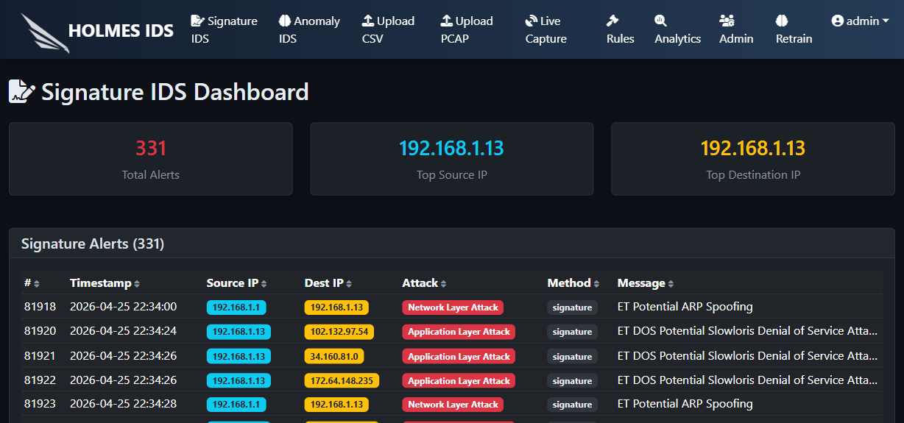

# HOLMES IDS

**Hybrid Online Learning Model for Enhanced Security**

HOLMES IDS is a hybrid Intrusion Detection System graduation project that combines signature-based detection, anomaly-based machine learning, explainability, continual learning, dashboard analytics, and role-based access control in one web application.

> **Graduation Project Note**
> This repository is my graduation project for Capital University, Faculty of Computers and Artificial Intelligence, Medical Informatics Department. It is an academic prototype for IDS research, experimentation, and demonstration. It is not presented as an enterprise production security platform.



## Project Scope

HOLMES IDS was built to explore a practical hybrid IDS workflow:

- Detect known attacks with signature rules.
- Detect behavioral anomalies with trained machine learning models.
- Analyze uploaded CSV flow records and PCAP files.
- Monitor live traffic when packet capture drivers and permissions are available.
- Explain anomaly alerts using SHAP/LIME-style feature contribution views.
- Support human-in-the-loop continual learning with labels, retraining, promotion, and rollback.
- Provide analyst dashboards for alerts, rules, analytics, users, and retraining data.

## Key Features

| Area | What HOLMES IDS Provides |
| --- | --- |
| Signature IDS | Rule-based matching for known attack patterns using bundled default rules. |
| Anomaly IDS | Flow-based anomaly prediction using trained models, scaler, label encoder, and feature order files. |
| CSV Analysis | Batch prediction for uploaded CSV samples. |
| PCAP Analysis | Signature detection for uploaded packet capture files, with optional TLS metadata support through `tshark`. |
| Live Capture | Interface selection, capture start/stop controls, signature checks, anomaly checks, and alert storage. |
| Explainability | Alert explanation views for stored anomaly alert features. |
| Continual Learning | Human labels, candidate retraining, model evaluation, model promotion, and rollback support. |
| Analytics | Query builder for alerts, logs, rules, users, and training data. |
| Security Controls | Authentication, session handling, CSRF-aware API flow, and role-based access control. |

## Corrected Evaluation Summary

The dissertation and defense materials use the following corrected Chapter 4 values:

| Metric | Result |
| --- | ---: |
| Stacking Classifier accuracy | 92.74% |
| Stacking Classifier precision | 92.74% |
| Stacking Classifier recall | 92.74% |
| Stacking Classifier F1-score | 92.74% |
| Full hybrid pipeline accuracy | 94.40% |
| Full hybrid pipeline precision | 92.74% |
| Full hybrid pipeline recall | 92.85% |
| Full hybrid pipeline F1-score | 92.02% |
| Benign false positive rate | approximately 7.65% |
| Simulated out-of-distribution detection | 92 / 100 samples detected |

These results describe the project evaluation setup and should not be interpreted as guaranteed zero-day detection or production readiness.

## Architecture Overview

```text
React + Vite Frontend
        |
        | /api/*
        v
Flask Backend
        |
        +-- Authentication and RBAC
        +-- Signature Detection Engine
        +-- Anomaly Detection Engine
        +-- Live Capture Service
        +-- Explainability Module
        +-- Continual Learning Module
        +-- Analytics Query Engine
        |
        v
SQLite Database + Model Artifacts + Rule Files
```

## Repository Structure

```text
Holmes-IDS-Helwan/
├── frontend/                  React + Vite web interface
├── tests/                     pytest test suite
├── Rules/                     bundled default signature rules
├── Models/                    trained models, scaler, encoders, feature order, and datasets
├── DB/                        local SQLite database folder
├── uploads/                   runtime upload folder
├── docs/screenshots/          README screenshots
├── UML/                       original UML/design assets
├── UI.py                      Flask backend entry point
├── api_auth.py                authentication API routes
├── api_routes.py              main JSON API routes
├── auth.py                    users, roles, password hashing, access control
├── DB.py                      SQLite connection and table creation
├── signature_IDS.py           signature detection engine
├── anomaly_IDS.py             anomaly detection engine
├── live_capture.py            live packet capture workflow
├── explainability.py          alert explanation support
├── continual_learning.py      relabeling, retraining, promotion, rollback
├── analytics.py               analytics query builder
├── requirements.txt           Python dependencies
├── start_backend.bat          Windows backend launcher
└── start_frontend.bat         Windows frontend launcher
```

## Requirements

- Python 3.10 recommended
- Node.js 18 or newer
- npm
- Npcap on Windows, or libpcap on Linux, for live capture
- Wireshark/tshark only if TLS analysis is needed

## Fresh Clone Quick Start

Clone the repository:

```powershell
git clone https://github.com/Mazen2004212/Holmes-IDS-Helwan.git
cd Holmes-IDS-Helwan
```

Create and activate a virtual environment:

```powershell
python -m venv .venv
.\.venv\Scripts\activate
```

If PowerShell blocks activation:

```powershell
Set-ExecutionPolicy -Scope CurrentUser RemoteSigned
.\.venv\Scripts\activate
```

Install backend dependencies:

```powershell
python -m pip install --upgrade pip
pip install -r requirements.txt
```

Start the backend:

```powershell
python UI.py
```

The backend runs on:

```text
http://127.0.0.1:8000
```

Start the frontend in a second terminal:

```powershell
cd frontend
npm install
npm run dev
```

The frontend is configured for:

```text
http://127.0.0.1:5174
```

## Default Demo Login

```text
username: admin
password: admin
```

The default account is for local academic/demo use only. Change it before any real deployment or public demonstration environment.

## Common Workflows

| Workflow | Route |
| --- | --- |
| Signature dashboard | `/` |
| Anomaly dashboard | `/anomaly` |
| CSV anomaly detection | `/csv` |
| PCAP signature detection | `/upload_pcap` |
| Live capture | `/live` |
| Rules dashboard | `/rules` |
| Analytics query builder | `/analytics` |
| Continual learning | `/retrain` |
| User management | `/admin` |

## Running Tests

After activating the Python environment:

```powershell
python -m pytest tests -v
```

## Live Capture Notes

Live packet capture depends on operating system drivers and permissions.

On Windows:

- Install Npcap.
- Restart the machine after installation.
- Run the terminal, VS Code, or PowerShell as Administrator.
- Select the correct network interface inside the application.

On Linux:

- Install libpcap.
- Run with suitable packet capture permissions, or use `sudo` when required.

## TLS Analysis Notes

TLS-related PCAP functionality requires Wireshark/tshark to be installed and available from the system `PATH`.

Check availability with:

```powershell
tshark -v
```

## Troubleshooting

| Problem | Fix |
| --- | --- |
| Backend does not start | Activate `.venv`, install `requirements.txt`, then run `python UI.py`. |
| Frontend does not start | Run `npm install` inside `frontend/`, then `npm run dev`. |
| Frontend cannot call APIs | Make sure the backend is running on `http://127.0.0.1:8000`. |
| Live capture stops immediately on Windows | Install Npcap, restart Windows, and run the terminal as Administrator. |
| No capture interfaces appear | Reinstall Npcap and enable WinPcap API-compatible mode if needed. |
| TLS analysis fails | Install Wireshark and confirm `tshark -v` works. |
| Database is missing | Start the backend once. `DB/IDS.db` is created locally. |

## Git Hygiene

The project should not commit local runtime files such as:

- `.venv/`
- `node_modules/`
- `__pycache__/`
- local `.env` files
- generated frontend builds
- local logs
- runtime uploads
- local SQLite runtime databases

## Academic Disclaimer

HOLMES IDS is a graduation project prototype. It is designed for academic demonstration, controlled experiments, and IDS workflow exploration. It should be hardened, audited, tested on broader datasets, and deployed with secure operational controls before any real-world security use.
