# HOLMES IDS - System Design Mermaid Diagrams

Export each diagram as PNG or SVG and send the rendered images back. Use the exact figure names below so they can be inserted into the final DOCX.

Recommended export names:

- `figure_3_1_admin_use_case.png`
- `figure_3_2_system_use_case.png`
- `figure_3_3_system_component.png`
- `figure_3_4_class_diagram.png`
- `figure_3_5_login_sequence.png`
- `figure_3_6_live_capture_sequence.png`
- `figure_3_7_csv_prediction_sequence.png`
- `figure_3_8_pcap_scan_sequence.png`
- `figure_3_9_retraining_sequence.png`
- `figure_3_10_activity_live_capture.png`
- `figure_3_11_er_diagram.png`
- `figure_4_1_high_level_architecture.png`
- `figure_4_2_detection_pipeline.png`
- `figure_4_3_deployment_diagram.png`

## Figure 3.1 - Admin Use Case Diagram

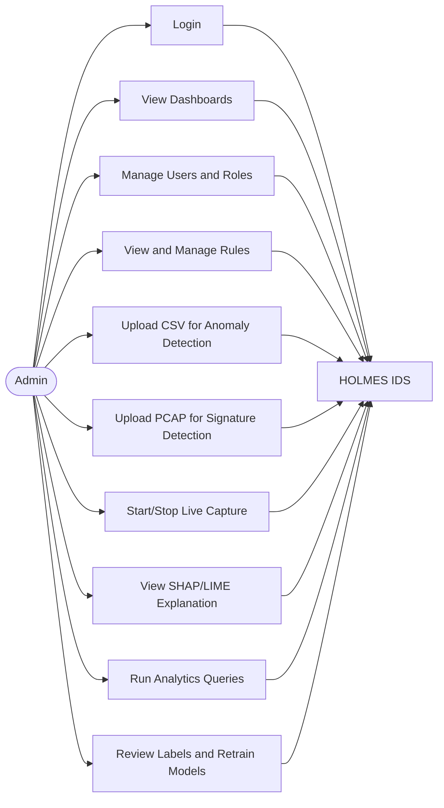

## Figure 3.2 - IDS System Use Case Diagram

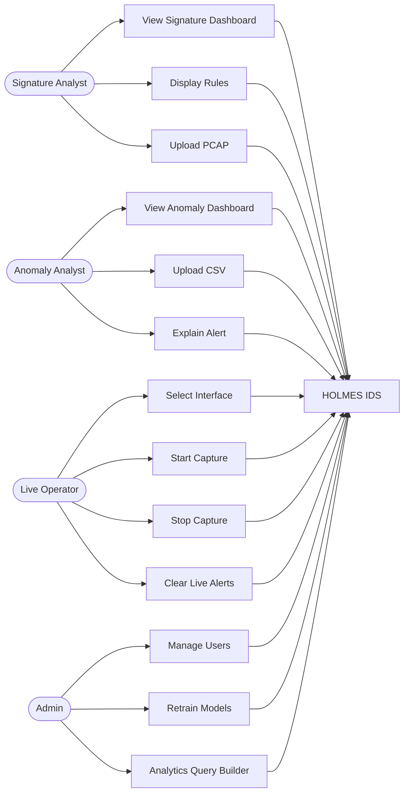

## Figure 3.3 - System Component Diagram

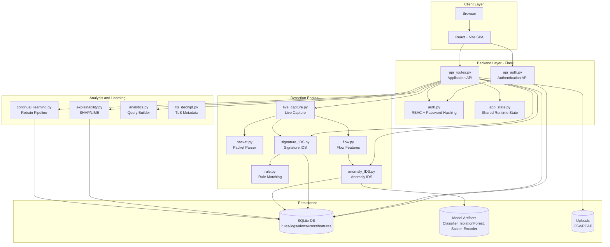

## Figure 3.4 - Class Diagram

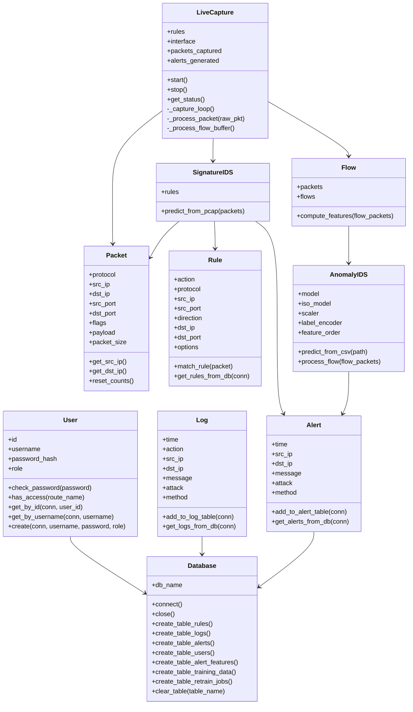

## Figure 3.5 - Login Sequence Diagram

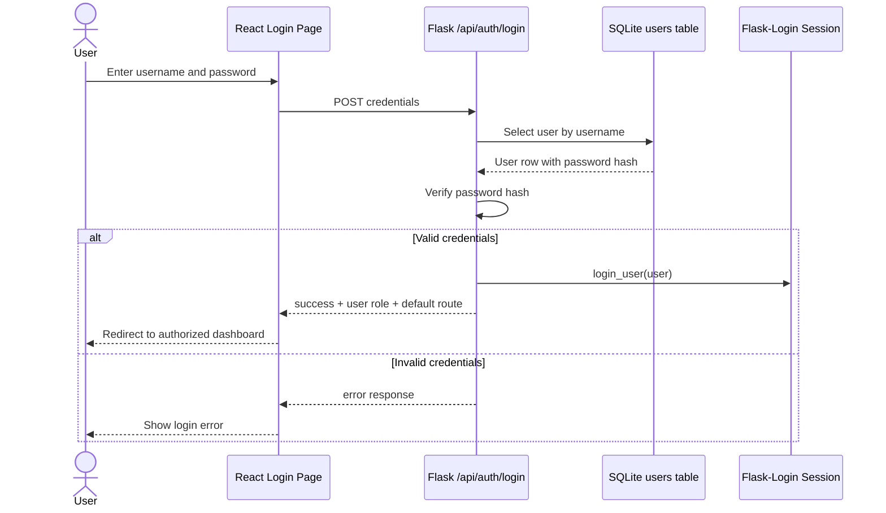

## Figure 3.6 - Live Capture Sequence Diagram

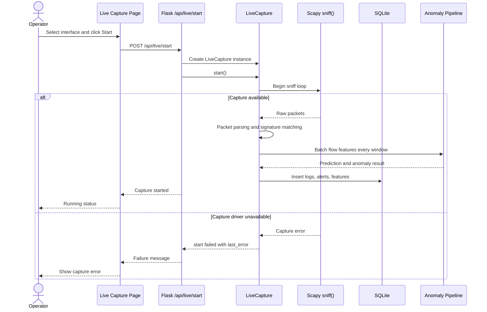

## Figure 3.7 - CSV Prediction Sequence Diagram

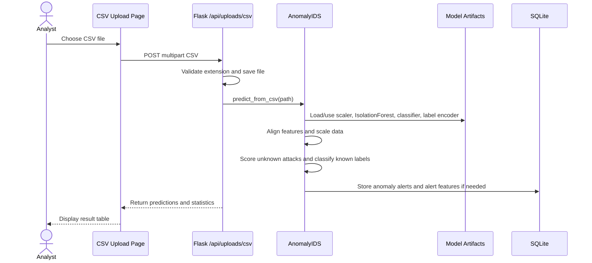

## Figure 3.8 - PCAP Scan Sequence Diagram

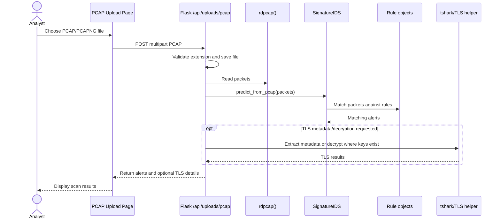

## Figure 3.9 - Retraining Sequence Diagram

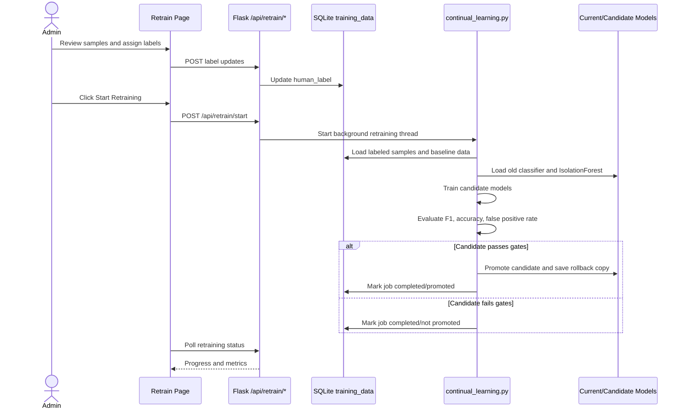

## Figure 3.10 - Live Capture Activity Diagram

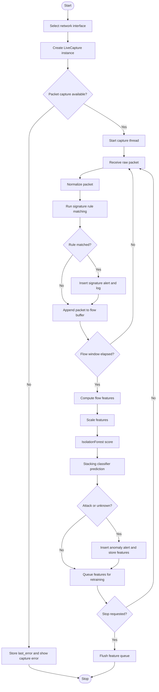

## Figure 3.11 - ER Diagram

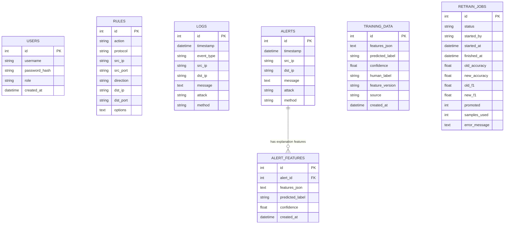

## Figure 4.1 - High-Level Architecture

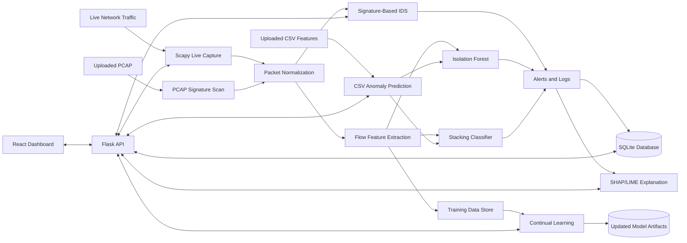

## Figure 4.2 - Detection Pipeline

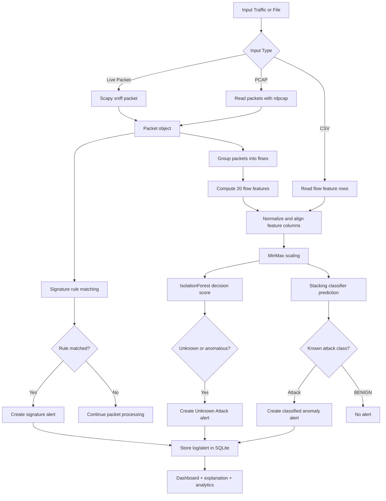

## Figure 4.3 - Deployment Diagram

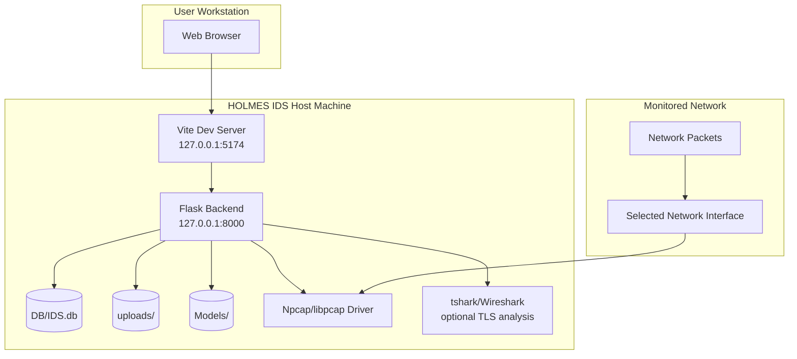

